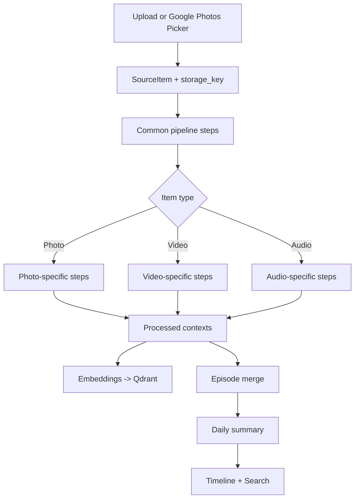

# Ingestion Details

This document describes the current ingestion pipeline for photos, videos, and audio, plus how contexts are defined, merged, and grouped into episodes and daily summaries.

---

## 0) Overview

The pipeline is deterministic, versioned, and idempotent. Each step stores derived artifacts and/or processed contexts with a `producer_version` + `input_fingerprint` so reprocessing can skip unchanged work.

### End-to-end flow (diagram)



---

## 1) Common pipeline steps (all items)

These steps run for every item, in order:

1. `fetch_blob` (v1)
   - Fetches bytes from storage (Supabase or signed remote URL).
2. `content_hash` (v1)
   - SHA256 for exact dedupe.
3. `metadata` (v1)
   - Stores content type, size, filename, provider metadata.
4. `media_metadata` (v2)
   - ffprobe-based: duration, width/height, fps, bitrate.
5. `exif` (v1)
   - EXIF datetime + GPS if present.
6. `preview` (v1)
   - HEIC/HEIF preview to JPEG for UI compatibility (derived artifact: `preview_image`).
7. `phash` (v1)
   - Perceptual hash for near-duplicate image detection.
8. `event_time` (v1)
   - Canonical timestamp: EXIF/container -> provider metadata -> client-provided -> server receive time.
   - Stores `event_time_source` + `event_time_confidence`.
   - Uses `client_tz_offset_minutes` when EXIF is naive.
9. `dedupe` (v1)
   - Exact + near-duplicate detection; sets `canonical_item_id` and can skip expensive steps.
10. `geocode` (v1)
    - Reverse-geocode GPS if available.
11. `caption` (v1)
    - Initial caption from filename (later overridden by first context).

---

## 2) Photo pipeline (step-by-step)

Steps after the common pipeline:

1. `ocr` (v1)
   - OCR text extraction (if enabled).
2. `vlm` (v3)
   - Gemini VLM prompt `lifelog_image_analysis_v2`.
   - Output: 1..N contexts with full taxonomy.
3. `contexts` (v2)
   - Semantic merge within item (Jaccard). See Section 6.
   - Persists `processed_contexts` (is_episode=false).
   - Updates `caption` to primary activity context summary.
4. `embeddings` (v2)
   - `vector_text` -> Qdrant upsert (context_id).
5. `episode_merge` (v1)
   - Enqueues `episodes.update_for_item` task.

Outputs:
- `derived_artifacts`: `preview_image`, `ocr`, `vlm_observations`.
- `processed_contexts` (multiple per item).
- Qdrant vectors keyed by context ID.

---

## 3) Video pipeline (step-by-step)

Steps after the common pipeline:

1. `keyframes` (v4)
   - Scene-based keyframes with interval fallback (`video_keyframe_mode=scene`).
   - Always captures a `t=0` poster (`video_keyframes_always=true`).
   - Stored under `derived_artifacts` with `frames[]` + `poster` storage key.
2. `video_preview` (v1, optional)
   - Short MP4 preview clip (disabled by default via `video_preview_enabled=false`).
3. `media_chunk_understanding` (v2)
   - Uses ffmpeg to segment the video into chunks.
   - Gemini processes each chunk and returns:
     - `transcript` (verbatim)
     - `contexts` (1..5 per chunk)
   - Aggregate transcript + segments stored in `processed_content` and `derived_artifacts`.
4. `media_summary` (v1)
   - Builds a high-level `activity_context` from contexts + transcript.
5. `transcript_context` (v1)
   - Adds a transcript snippet context for recall.
6. `generic_context` (v1)
   - Fallback if no contexts exist.
7. `contexts` (v2)
   - Semantic merge within item (see Section 6).
8. `embeddings` (v2)
   - Qdrant upsert.
9. `episode_merge` (v1)

Outputs:
- `derived_artifacts`: `keyframes`, `media_chunk_analysis`, `transcription`, `video_preview` (if enabled).
- `processed_contexts` (chunk contexts + summary context).
- Qdrant vectors keyed by context ID.

---

## 4) Audio pipeline (step-by-step)

Steps after the common pipeline:

1. `media_chunk_understanding` (v2)
   - Segments audio into chunks; Gemini returns transcript + contexts per chunk.
2. `media_summary` (v1)
   - High-level summary context from transcript + contexts.
3. `transcript_context` (v1)
   - Transcript snippet context (audio uses `knowledge_context`).
4. `generic_context` (v1)
   - Fallback if no contexts exist.
5. `contexts` (v2)
   - Semantic merge within item.
6. `embeddings` (v2)
7. `episode_merge` (v1)

Outputs:
- `derived_artifacts`: `media_chunk_analysis`, `transcription`.
- `processed_contexts` + Qdrant vectors.

---

## 5) Context definitions (taxonomy)

All contexts follow this schema:

```
{
  "context_type": "activity_context",
  "title": "...",
  "summary": "...",
  "keywords": ["..."],
  "entities": [{"type": "person|place|object|org|food|topic", "name": "...", "confidence": 0..1}],
  "location": {"name": "...", "lat": 0.0, "lng": 0.0},
  "vector_text": "...",
  "processor_versions": {...}
}
```

### Context types

1) `activity_context` (required)
- What the user was doing/experiencing at capture time.

2) `social_context`
- Interactions with other people (who + what).

3) `location_context`
- Where the user is; use specific place names when possible.

4) `food_context`
- Meals, drinks, cooking details.

5) `emotion_context`
- The user's mood only if supported by evidence.

6) `entity_context`
- Salient people/places/objects/organizations/topics.

7) `knowledge_context`
- Information to remember (menus, signs, slides, tickets, notes).

### Perspective rules
- Write from the user's point of view (camera-holder/recorder).
- Avoid invented names, relationships, or emotions.

---

## 6) Context merge (semantic merge within an item)

After contexts are produced, they are deduplicated within the same item to reduce redundancy.

Merge rules (see `pipeline/steps.py`):
- Only merge when `context_type` matches.
- If both contexts include `chunk_index`, only merge when they are the same chunk.
- Titles and summaries are compared; identical or substring matches merge immediately.
- Otherwise, compute Jaccard similarity over tokenized `title + summary + keywords`.
- If similarity >= `semantic_merge_min_jaccard` (default `0.6`), merge:
  - Title: keep the longer title.
  - Summary: combine unique summaries ("A / B").
  - Keywords/entities: union with de-dup.
  - Location: keep if missing.
  - `processor_versions.semantic_merge = "v1"`, `merged_count++`.

---

## 7) Episode merge (cross-item clustering)

Episodes group related items into a higher-level memory for the day timeline.

### How episodes are formed

1. Trigger:
   - Each completed item enqueues `episodes.update_for_item`.

2. Primary context:
   - The item `activity_context` is the anchor.

3. Candidate episodes:
   - Qdrant search for `is_episode=true` + `context_type=activity_context`.
   - Filter by time gap (within `episode_merge_max_gap_minutes`, default 90).
   - Choose best candidate by Qdrant score or Jaccard similarity.

4. Episode ID:
   - Reuse `episode_id` from existing episode contexts or create a new UUID.

5. Episode time window:
   - Computed from item event time + optional metadata window or duration.
   - Manual uploads can include an explicit time window, used as start/end.

6. Context grouping:
   - All item contexts are grouped by `context_type`.
   - Merge within each type (`title`, `summary`, `keywords`, `entities`).

7. Gemini episode summary:
   - If the episode `activity_context` is not user-edited, Gemini generates a
     fresh title/summary/keywords across all items in the episode.
   - User edits are preserved (`edited_by_user=true`).

8. Persistence:
   - Episode contexts saved as `processed_contexts` with `is_episode=true` and
     `processor_versions.episode_id` set.
   - Embeddings are re-upserted for episode contexts.

---

## 8) Daily summaries

Daily summaries are derived from episode activity contexts:

- Summary text: "Highlights: <episode titles>".
- Stored as `processed_contexts` with `context_type=daily_summary`.
- Embedded and searchable in Qdrant.
- Updated when episodes change or a user edits an episode summary.

---

## 9) Embeddings and search

- `vector_text` is built from `title + summary + keywords`.
- Embeddings are generated with Gemini (`gemini-embedding-001`).
- Qdrant payload includes:
  - `user_id`, `context_type`, `event_time_utc`, `source_item_ids`, `is_episode`.
- `/search` returns context-level hits for items, episodes, and daily summaries.

---

## 10) Derived artifacts + storage

Key artifact types:

- `preview_image` (photos): JPEG fallback for HEIC/HEIF.
- `keyframes` (video): list of frame keys + `poster` key at t=0.
- `media_chunk_analysis` (video/audio): per-chunk transcripts + contexts.
- `transcription` (video/audio): aggregated transcript + segments.
- `media_metadata` (video/audio): duration, fps, size, bitrate.
- `video_preview` (optional): short MP4 snippet.

Storage layout (Supabase):
- Originals: `originals/...`
- Derived: `users/<user_id>/derived/<item_id>/...`

---

## 11) Guardrails and limits (MVP defaults)

- `media_max_bytes=1_000_000_000`
- `video_max_duration_sec=300`
- `audio_max_duration_sec=3600`
- `video_understanding_max_bytes=19_000_000`
- `audio_understanding_max_bytes=19_000_000`
- `media_chunk_target_bytes=10_000_000`
- `video_chunk_duration_sec=60`
- `audio_chunk_duration_sec=300`
- `media_chunk_max_chunks=240`
- `transcription_storage_max_bytes=500_000` (oversized transcripts are stored in object storage and referenced by key)
- Video chunk duration is capped by bitrate-derived size (keeps chunks under the target bytes).
- Audio chunk duration is capped by sample rate + channel settings (16kHz mono by default).

If `ffmpeg` is missing, keyframe extraction and chunked understanding are skipped.

---

## 12) Failure/skip behavior

- Missing `ffmpeg`: keyframes/chunking steps return `status=skipped`.
- Gemini disabled (`provider=none`): media understanding steps return `status=disabled`.
- Oversized chunk: chunk is skipped and recorded as `status=skipped` with error.
- Network or provider failure: step records `status=error` and pipeline continues with fallbacks.
