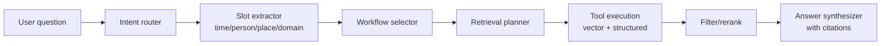

# Lifelog Ingestion + RAG System Design (Draft)

Status: draft for iteration (week 3+ implementation)

## References

- MineContext-inspired workflow: `docs/minecontext/workflow.md`
- Updated lifelog architecture notes: `docs/minecontext/lifelog_updated_arch.md`
- Updated PRD sections (context taxonomy + tool-based RAG): `docs/minecontext/updated_prd_sections.md`
- ESP32/device ingestion proposal (post-MVP): `docs/esp32-ingestion/README.md`
- MVP roadmap: `lifelog-mvp-dev-plan.md`

## 1) Goals (what “good” looks like)

**Ingestion**
- Accept images/videos/audio/documents from multiple sources (manual upload, Google Photos picker, devices).
- Normalize timestamps and metadata so everything fits into one reliable timeline.
- Deduplicate aggressively (exact + near-duplicate) to control cost for “capture every 30s” devices.
- Extract rich, structured metadata (entities/objects/locations/activities) + usable text (captions, OCR, transcripts).
- Produce embeddings (primarily text-based) and store everything needed for later retrieval + downstream tasks.
- Make the pipeline **modular and versioned** so we can swap models/prompts or add domain-specific enrichers (food, clothing, etc.) and reprocess safely.

**RAG / downstream**
- Answer memory questions (“what did I eat 3 days ago?”, “where did I go?”, “who did I meet?”) with time + entity awareness.
- Support multiple workflows (agents/tools) depending on intent and domain.
- Prefer retrieval based on **structured filters first** (time/person/place) + semantic search second, with hierarchical “summary → episode → raw” drill-down.

Non-goals for first iteration (can be added later)
- Face recognition / identity resolution across time (privacy + complexity).
- Full background sync for Google Photos (Picker-only for MVP).
- Perfect location inference when GPS is missing (start with EXIF + simple heuristics).

## 2) Core concepts (data you store)

Think of ingestion outputs as **versioned artifacts**. “Raw media” is immutable; everything derived can be regenerated.

### 2.1 Source item vs asset (recommended separation)

- **`SourceItem` (occurrence)**: “this file arrived from source X with timestamp Y”
  - examples: “Google Photos item ABC”, “ESP32 photo 2025-12-26T10:15:30Z”
- **`Asset` (canonical bytes)**: “this exact media bytes (or near-duplicate cluster)”
  - multiple source items can point to the same asset (same content hash, or near-dup cluster)

If you want minimal schema change, you can keep only `source_items` and store `content_hash` + `canonical_item_id`; the “asset” is conceptual. If you want cleaner dedupe/reprocessing, add an `assets` table.

### 2.2 Derived artifacts

Every processing step should write a **DerivedArtifact** (DB row) with:
- `artifact_type` (e.g. `exif`, `phash`, `ocr`, `transcript`, `keyframes`, `vlm_observations`, `contexts`, `episode_cluster`)
- `producer` + `version` (e.g. `whisper:v3`, `gemini-vision:prompt_v5`)
- `input_fingerprint` (hash of bytes or upstream artifact ids) to enable caching/idempotency
- `payload` (JSONB) and/or `storage_key` for large artifacts (e.g., transcript with timestamps)

You can implement this as:
- an expansion of the current `processed_content` table (add `producer`, `version`, `input_fingerprint`), or
- a new `derived_artifacts` table and keep `processed_content` for “UI-ready” outputs.

### 2.3 “ProcessedContext” (the unit of retrieval)

Borrow the MineContext idea: one media item produces **1..N contexts** (orthogonal views).

**ProcessedContext** (stored in DB + embedded in Qdrant) should have:
- `context_type` (activity/social/location/food/emotion/entity/knowledge…)
- `title`, `summary`, `keywords`
- `entities` (people/places/objects), optional `location` structure
- `event_time` (normalized) + optionally `start_time`/`end_time` for merged episodes
- `source_item_ids` (provenance)
- `vector_text` (what you embed)
- `processor_versions` (so you can reprocess and compare)

Qdrant point IDs should be **context IDs** (not raw item IDs) so you can:
- store multiple contexts per item
- store merged “episode contexts”
- delete/replace contexts when merging/reprocessing

### 2.4 Context taxonomy (more detailed)

One media item can yield multiple orthogonal contexts (MineContext pattern). Lifelog-specific context types (from `docs/minecontext/lifelog_updated_arch.md`) typically start with:

```python
from enum import Enum

class LifelogContextType(str, Enum):
    ACTIVITY = "activity_context"      # What user was doing
    ENTITY = "entity_context"          # People, places, objects
    SOCIAL = "social_context"          # Social interactions
    LOCATION = "location_context"      # Place-based memories
    FOOD = "food_context"              # Meals, restaurants, cooking
    EMOTION = "emotion_context"        # Mood, feelings
    HEALTH = "health_context"          # Exercise, sleep (from wearables)
    KNOWLEDGE = "knowledge_context"    # Documents, notes (chunked)
```

Activity categories (used inside `activity_context`) can start with a simple enum (from `docs/minecontext/lifelog_updated_arch.md` / `docs/minecontext/updated_prd_sections.md`):

```python
class LifeActivity(str, Enum):
    # Daily routines
    SLEEPING = "sleeping"
    EATING = "eating"
    COOKING = "cooking"
    CLEANING = "cleaning"

    # Work & learning
    WORKING = "working"
    STUDYING = "studying"
    READING = "reading"
    WRITING = "writing"

    # Physical
    EXERCISING = "exercising"
    WALKING = "walking"
    RUNNING = "running"
    SPORTS = "sports"

    # Social
    CHATTING = "chatting"
    MEETING = "meeting"
    SOCIALIZING = "socializing"
    CALLING = "calling"

    # Entertainment
    WATCHING_TV = "watching_tv"
    GAMING = "gaming"
    LISTENING_MUSIC = "listening_music"

    # Creative
    DRAWING = "drawing"
    PHOTOGRAPHY = "photography"
    CRAFTING = "crafting"

    # Other
    COMMUTING = "commuting"
    SHOPPING = "shopping"
    TRAVELING = "traveling"
    RELAXING = "relaxing"
```

### 2.5 Multi-context extraction example (why 1..N contexts)

From `docs/minecontext/updated_prd_sections.md`:

One photo of “cooking dinner with friends” can produce:
- `activity_context`: “Cooking Italian dinner”
- `social_context`: “Evening with Alice and Bob”
- `food_context`: “Homemade pasta carbonara”
- `location_context`: “Home kitchen”
- `entity_context`: “Alice”, “Bob”, “pasta maker”, “red wine”

This is what makes later retrieval flexible (“all meals with Alice” vs “all cooking activities”).

### 2.6 Proposed Postgres schema additions (draft)

This is a “north star” schema. You can implement it incrementally (start with `processed_contexts`, then add `assets` / `derived_artifacts` when dedupe + reprocessing needs grow).

```sql
-- Canonical bytes (optional but recommended for dedup + caching)
create table assets (
  id uuid primary key default gen_random_uuid(),
  user_id uuid not null references users(id) on delete cascade,
  media_type text not null check (media_type in ('photo','video','audio','document')),
  content_hash text not null,
  phash text null,
  duration_seconds numeric null,
  width int null,
  height int null,
  created_at timestamptz not null default now(),
  unique (user_id, content_hash)
);

-- Source occurrence (existing source_items can grow these columns instead)
-- Add: asset_id, provider/provider_item_id, device_id, event_time_utc, event_time_source/confidence, duplicate_of_asset_id

-- Versioned outputs of processing steps (can be an evolution of processed_content)
create table derived_artifacts (
  id uuid primary key default gen_random_uuid(),
  user_id uuid not null references users(id) on delete cascade,
  source_item_id uuid not null references source_items(id) on delete cascade,
  asset_id uuid null references assets(id) on delete set null,
  artifact_type text not null,
  producer text not null,
  producer_version text not null,
  input_fingerprint text not null,
  payload jsonb not null default '{}'::jsonb,
  storage_key text null,
  created_at timestamptz not null default now(),
  unique (source_item_id, artifact_type, producer, producer_version, input_fingerprint)
);

-- Retrieval unit (store 1..N per item + merged episode contexts)
create table processed_contexts (
  id uuid primary key default gen_random_uuid(),
  user_id uuid not null references users(id) on delete cascade,
  context_type text not null,
  title text not null,
  summary text not null,
  keywords jsonb not null default '[]'::jsonb,
  entities jsonb not null default '[]'::jsonb,
  location jsonb not null default '{}'::jsonb,
  event_time_utc timestamptz not null,
  start_time_utc timestamptz null,
  end_time_utc timestamptz null,
  is_episode boolean not null default false,
  source_item_ids uuid[] not null,
  merged_from_context_ids uuid[] not null default '{}'::uuid[],
  vector_text text not null,
  processor_versions jsonb not null default '{}'::jsonb,
  created_at timestamptz not null default now()
);
create index processed_contexts_user_time_idx on processed_contexts(user_id, event_time_utc desc);
create index processed_contexts_user_type_time_idx on processed_contexts(user_id, context_type, event_time_utc desc);

-- Optional: normalized entity graph (good for “who did I meet?” and linking)
create table entity_nodes (
  id uuid primary key default gen_random_uuid(),
  user_id uuid not null references users(id) on delete cascade,
  entity_type text not null check (entity_type in ('person','place','object','org','food','activity','other')),
  canonical_name text not null,
  aliases text[] not null default '{}'::text[],
  metadata jsonb not null default '{}'::jsonb,
  created_at timestamptz not null default now(),
  unique (user_id, entity_type, canonical_name)
);

create table entity_edges (
  id uuid primary key default gen_random_uuid(),
  user_id uuid not null references users(id) on delete cascade,
  from_entity_id uuid not null references entity_nodes(id) on delete cascade,
  to_entity_id uuid not null references entity_nodes(id) on delete cascade,
  relation text not null,
  context_id uuid null references processed_contexts(id) on delete set null,
  confidence real not null default 0.5,
  created_at timestamptz not null default now()
);
```

## 3) End-to-end ingestion flow (high level)

```mermaid
flowchart TB
  A[Sources<br/>upload / google photos / devices] --> B[Object storage<br/>raw media]
  A --> C[Create SourceItem (+ optional Asset)]
  C --> D[Enqueue pipeline.run(item_id)]

  D --> E[Normalize time + basic metadata]
  E --> F[Dedup<br/>exact + near-dup]
  F -->|duplicate| G[Link to canonical<br/>skip expensive steps]
  F -->|unique| H[Type-specific processing]

  H --> I[Image: OCR + VLM]
  H --> J[Video: keyframes/scenes + audio -> transcript + VLM]
  H --> K[Audio: transcript/diarize + summarize]
  H --> L[Docs: extract text + chunk]

  I --> M[Multi-context extraction]
  J --> M
  K --> M
  L --> M

  M --> N[Semantic merge into episodes<br/>(time-window clustering)]
  N --> O[Embeddings for contexts/chunks]
  O --> P[(Qdrant vector store)]
  M --> Q[(Postgres metadata/artifacts)]
  N --> Q
```

Key properties:
- **Idempotent**: `pipeline.run(item_id)` can be retried safely.
- **Cacheable**: expensive steps keyed by `(asset_hash, step_name, step_version, config_hash)`.
- **Composable**: add/remove steps without rewriting the task.

### 3.1 Storage key conventions (recommended)

Keep storage paths predictable so downstream tools can fetch artifacts without scanning:

- Raw: `users/{user_id}/raw/{yyyy}/{mm}/{dd}/{source}/{source_item_id}/{filename}`
- Derived: `users/{user_id}/derived/{source_item_id}/{artifact_type}/{...}`
  - thumbnails: `.../thumbnail.jpg`
  - video keyframes: `.../keyframes/{scene_id}_{t_sec}.jpg`
  - audio extract: `.../audio/audio.wav`
  - transcript: `.../transcript/transcript.json`

## 4) Timestamp normalization + timeline alignment

Goal: a single `event_time_utc` you can trust for timeline grouping, clustering, and “what happened at 7pm?”

### 4.1 Candidate timestamp sources (priority order)

1) Embedded metadata:
   - image: EXIF `DateTimeOriginal` (+ `OffsetTimeOriginal` if present), GPS time
   - video: QuickTime `creation_time` / container metadata
2) Provider metadata:
   - Google Photos `mediaMetadata.creationTime`
3) Client-provided `captured_at`:
   - devices: NTP-derived timestamp
4) Server-observed timestamps:
   - upload receive time / ingest time

### 4.2 Normalization output fields

Store (at least) these fields per SourceItem:
- `event_time_utc` (datetime)
- `event_time_source` (`exif|provider|client|server`)
- `event_time_confidence` (0..1)
- `original_timezone_offset_minutes` (nullable)
- `time_correction_offset_ms` (nullable; for device drift correction)

### 4.3 Device drift correction (ESP32 / wearables)

Maintain per device:
- `estimated_clock_offset_ms` computed as a rolling median of `(server_received_time - device_captured_at)`
- If device timestamps look implausible, replace with `server_received_time - estimated_offset`

### 4.4 Aligning multi-modal artifacts

When you generate transcripts or scene segmentation, keep **relative timestamps**:
- video: `{start_sec, end_sec, scene_id, keyframe_storage_key}`
- audio transcript: `{start_ms, end_ms, text, speaker}`

Absolute time is `event_time_utc + start_offset`.

This enables “what did they say when the menu appeared?” and better episode merging.

## 5) Deduplication strategy (exact + near-duplicate)

### 5.1 Exact duplicate (cheap, reliable)

Compute `sha256` of bytes (or a stable object hash if storage provides it).

Recommended uniqueness keys:
- manual upload: `(user_id, content_hash)`
- Google Photos: `(user_id, provider='google_photos', provider_item_id)`
- devices: `(user_id, device_id, original_filename)` plus optional `(user_id, content_hash)`

Handling:
- If exact duplicate, create SourceItem, mark `duplicate_of_asset_id` (or `canonical_item_id`) and **skip expensive VLM/transcription**.
- Still allow multiple occurrences in the timeline if they have different timestamps.

### 5.2 Near-duplicate (critical for “photo every 30s”)

**Images**
- Compute perceptual hash (`dHash`/`pHash`) on a downscaled thumbnail.
- Compare to recent hashes in a rolling window (e.g., last 2–10 minutes per device) and/or within the same day.
- If Hamming distance < threshold (e.g., <= 5), treat as near-duplicate.

**Videos**
- Generate a “signature” from sampled keyframes:
  - sample 1 fps or scene keyframes
  - compute pHash per frame; store as list + duration
  - near-dup if many frame hashes match within threshold AND durations are close
- Optionally add audio fingerprint (Chromaprint) if you need robustness.

**Audio**
- Prefer exact hash; near-dup can use a fingerprint (Chromaprint) or embedding similarity on short summary.

**Docs**
- Extract canonical text, normalize whitespace, hash the text.

Handling near-duplicates:
- Keep all raw items (for audit), but:
  - mark them as “redundant”
  - only run full VLM on a representative item per near-dup cluster
  - optionally run a cheap caption/OCR only, or skip entirely

## 6) Media processing pipelines (detailed)

This section describes what to extract for each media type and how to modularize the work.

### 6.1 Shared pre-processing (all types)

Steps (as pipeline modules):
1) `DownloadOrFetch`: stream bytes from storage or provider URL to a temp file
2) `SniffMime`: validate type, fill `content_type`, detect container/codec
3) `ExtractTechnicalMetadata`:
   - images: width/height, EXIF block, GPS, camera model
   - videos: duration, fps, resolution, audio tracks
   - audio: duration, codec, sample rate
4) `ComputeContentHash`
5) `ComputePerceptualHash` (if applicable)
6) `GeneratePreviewArtifacts`:
   - image thumbnail
   - video poster frame + small mp4 preview (optional)
   - audio waveform preview (optional)

### 6.1.1 Processor manager pattern (implementation sketch)

From `docs/minecontext/updated_prd_sections.md` / `docs/minecontext/lifelog_updated_arch.md`, a simple router keeps per-type logic modular:

```python
class MediaProcessorManager:
    def __init__(self):
        self.processors = {
            "photo": ImageProcessor(),
            "video": VideoProcessor(),
            "audio": AudioProcessor(),
            "document": DocumentProcessor(),
        }

    async def process(self, source_item) -> list:
        processor = self.processors[source_item.item_type]
        return await processor.process(source_item)
```

### 6.2 Image pipeline

Primary outputs:
- EXIF/GPS + normalized timestamp
- OCR text (if any)
- VLM observation (caption + entities/objects + “what’s happening”)
- Multi-context items (activity/social/location/food/emotion/entity)

Suggested steps:
1) `ImageDedupGate` (uses content hash + pHash sliding window)
2) `OCR` (Tesseract/cloud OCR, configurable)
3) `VLMAnalyzeImageBatch`:
   - batch N images per call for cost (MineContext pattern)
   - response format: JSON (per image)
4) `ContextsFromObservations`:
   - produce 1..N ProcessedContext per image
5) `EmbedContexts` + `UpsertContextsToQdrant`

Batching implementation sketch (MineContext-style; adapted from `docs/minecontext/lifelog_updated_arch.md`):

```python
class ImageProcessor:
    def __init__(self, llm, embedder, config):
        self.llm = llm
        self.embedder = embedder
        self.batch_size = config.get("batch_size", 10)
        self.batch_timeout = config.get("batch_timeout_seconds", 30)
        self.queue = Queue()
        self.start_batch_worker()

    async def process(self, source_item):
        image_bytes = await self.load_image(source_item.storage_key)
        exif = extract_exif(image_bytes)
        return await self.enqueue_for_batch(source_item, image_bytes, exif)

    async def process_batch(self, batch):
        messages = build_multimodal_prompt(batch, prompt_key="lifelog_image_analysis_v1")
        vlm_json = await self.llm.chat(messages, response_format="json")
        contexts = contexts_from_vlm(vlm_json, batch)
        merged = await semantic_merge(contexts, prompt_key="lifelog_semantic_merging_v1")
        await upsert_contexts(merged, embedder=self.embedder)
        return merged
```

Example VLM JSON schema (minimal, extensible):
```json
{
  "image_0": {
    "observations": {
      "caption": "Eating ramen at a restaurant with Alice.",
      "ocr_text": "IPPUDO",
      "objects": [{"name": "ramen", "confidence": 0.86}],
      "entities": [{"type": "person", "name": "Alice", "confidence": 0.78}],
      "location_hints": [{"name": "Ippudo", "confidence": 0.62}],
      "mood": {"label": "happy", "confidence": 0.55}
    },
    "contexts": [
      {"context_type": "food_context", "title": "Ramen at Ippudo", "summary": "...", "keywords": ["ramen","Alice"]},
      {"context_type": "social_context", "title": "Dinner with Alice", "summary": "...", "keywords": ["Alice"]}
    ]
  }
}
```

### 6.3 Video pipeline

Primary outputs:
- Technical metadata + normalized timestamp
- Keyframes + scene segmentation
- Audio track extraction
- Transcript with timestamps (+ optional diarization)
- VLM analysis on keyframes/scenes
- Multi-context items + optional episode candidate

Suggested steps:
1) `VideoDedupGate` (content hash + signature)
2) `ExtractKeyframes`:
   - cheap default: every N seconds (e.g. 2–5s)
   - better: scene detection + representative frame per scene
3) `ExtractAudioTrack` (AAC/WAV)
4) `TranscribeAudio`:
   - output segments with timestamps
   - optional diarization module (later)
5) `VLMAnalyzeKeyframes`:
   - batch frames per call
   - optionally give transcript snippets for better grounding
6) `SummarizeVideo`:
   - compress frame-level observations + transcript into a concise narrative
7) `ContextsFromVideo`:
   - create contexts for activity/social/location/food/emotion + “knowledge” if it’s a talk/screen recording
8) `EmbedContexts` + `UpsertContextsToQdrant`

Cost control knobs:
- cap max frames analyzed per video (e.g., 60)
- early stop if near-duplicate of previous captures
- downscale frames before VLM

### 6.4 Audio pipeline

Primary outputs:
- Technical metadata + timestamp
- Transcript (timestamps)
- Summary + extracted entities/topics
- Contexts (social, activity, emotion, knowledge)

Suggested steps:
1) `AudioDedupGate`
2) `TranscribeAudio` (timestamps)
3) `ExtractEntitiesFromTranscript` (LLM structured)
4) `SummarizeTranscript`
5) `ChunkTranscriptForEmbedding` (by time and/or semantics)
6) `EmbedChunksAndContexts` + `UpsertToQdrant`

### 6.5 Document pipeline

Primary outputs:
- Extracted text (OCR if scanned)
- Chunked text for embeddings
- Optional summary + entities

Suggested steps:
1) `DocDedupGate`
2) `ExtractText` (PDF/docx/html/md)
3) `ChunkText` (semantic chunker)
4) `EmbedChunks` + `UpsertToQdrant` as `knowledge_context`

### 6.6 People recognition & identity resolution (audio/video-first)

If you can’t reliably identify “who is who” from images (no face recognition), you can still build strong “who/what did we talk about” memories from **audio/video** by treating identity as **entity resolution over evidence** (transcripts + speakers), not as visual classification.

**Recommended pattern**
- Still process each media item individually to generate **idempotent, cacheable artifacts**:
  - transcript segments with timestamps
  - diarization segments with `speaker_cluster_id` (e.g., “speaker_A”)
  - per-item extracted entities/topics (with confidence + evidence spans)
- Then run a cross-item **merge/session layer** to produce coherent contexts (“episodes”):
  - group by time adjacency + overlap signals (shared `speaker_cluster_id`, similar topics, same location, same device session)
  - summarize once at the episode level rather than trying to stitch per-item summaries together

**Speaker → person name mapping**
- Keep diarization labels as stable internal IDs (`speaker_cluster_id`) even when you don’t know names.
- Add an optional LLM step that proposes mappings only when supported by transcript evidence (e.g., greetings/name mentions):
  - output: `{speaker_cluster_id ↔ person_entity_id}` with `confidence` + `evidence_snippets`
  - if ambiguous, store “unknown speaker” and avoid forcing a name
- Support user correction (“speaker_A is Bob”) and persist the mapping for future merges/retrieval.

**Long conversations spanning multiple recordings**
- Prefer merging **transcript chunks first** (deterministic by timestamps and gaps), then generating one summary/context for the merged transcript.
- Create episode contexts like:
  - `social_context`: who was present (known + unknown speakers)
  - `activity_context`: what was happening
  - `knowledge_context`: key topics/decisions (if it’s meeting-like)

**Modularity**
- Treat identity resolution as its own pipeline module (separate from captioning/summarization) so you can upgrade models/signals (voiceprints, better diarization, user-labeled speakers) without reprocessing everything else.

## 7) Context merging: from raw contexts → episodes → daily summaries

Raw captures can be noisy and redundant (especially devices). Build a hierarchy:

1) **Raw contexts**: 1..N per media item (fine-grained, high recall)
2) **Episode contexts**: merged contexts across a time window (high precision)
3) **Daily summaries**: narrative of the day + highlights

### 7.1 Episode clustering (timeline alignment)

Heuristic first, LLM-assisted merge second:

- Pre-group by:
  - `(user_id, context_type)`
  - time window (e.g., 2 hours, or dynamic based on gaps)
  - optional location proximity (same GPS cluster)
- Then run a “merge decision” LLM call (MineContext pattern) that outputs:
  - which contexts to merge
  - merged title/summary/entities
  - `start_time`, `end_time`, `duration_minutes`

Store episode contexts as first-class contexts with:
- `is_episode=true`
- `merged_from_context_ids=[...]`
- embeddings recomputed for the merged text

Semantic merge decision schema (reference)
- Input: a list of contexts (same `context_type`, same time window)
- Output: `decisions[]` with `merge_type` and either `merged_indices` + `data` or `indices`

This matches the prompt style in `docs/minecontext/updated_prd_sections.md` (see `lifelog_semantic_merging_v1` in “Prompt templates” below).

### 7.2 Daily summary generation

Nightly job per user/day:
- retrieve episode contexts + a small sample of raw contexts
- generate:
  - `daily_summary` text
  - highlights (3–10 bullet “moments”)
  - optional “daily reel” storyboard (future)
- embed the daily summary so broad queries can hit it quickly

## 8) Embeddings + indexing strategy

### 8.1 What to embed

Embed text that best captures “what happened”:
- contexts: `title + summary + keywords + normalized entity list + location string`
- transcripts: chunk text with timestamps
- documents: chunk text
- episode/daily summaries: the summary text

Optional later:
- image embeddings (CLIP/SigLIP) for image-to-image similarity
- multi-vector indexing in Qdrant (text + image vectors)

### 8.2 Qdrant payload schema (recommended)

Payload fields (minimum):
- `user_id`
- `context_id`
- `context_type`
- `event_time_utc`, `start_time_utc`, `end_time_utc`
- `source_item_ids`
- `entities` (lightweight list for filtering)
- `location` (string or structured)
- `artifact_versions` (for debugging)

Then queries can:
- filter by `user_id`
- pre-filter by date range or context_type
- run vector search on the filtered subset

## 9) Modularity: processors, profiles, and reprocessing

### 9.1 Processor interface

Define each step as a small module:
- `name`, `version`, `resources` (`cpu|gpu|io`)
- `inputs` / `outputs`
- `run(item, artifacts, config) -> artifacts`

Make orchestration config-driven:
- pipeline per `item_type`
- enable/disable steps per user or per profile

### 9.2 Profiles (domain customization)

Example profiles:
- `default`: general life logging extraction
- `food_focus`: extra food extraction prompts + nutrition hints
- `wardrobe_focus`: clothing attributes (colors/brands/outfits)

Profiles can be applied:
- explicitly by user preference, or
- automatically when a trigger context is detected (e.g., food_context confidence > 0.7)

### 9.3 Versioning + backfills

Store:
- `pipeline_version` on each run
- per-artifact `producer_version`

When you update prompts/models:
- mark old artifacts as stale (but keep them)
- enqueue a backfill job that recomputes only affected artifacts
- re-upsert updated contexts into Qdrant (delete old context IDs or keep with version tags)

## 10) RAG design: multi-agent, tool-based retrieval



### 10.1 Roles (agents) in the chat pipeline

1) **Intent Router**: classify query into a workflow:
   - `memory_qa`, `timeline_query`, `stats_query`, `summarize_day`, `simple_chat`, `task_planning`
2) **Slot Extractor**: structured parse:
   - time range, people, places, objects, domain (“food”, “clothing”), required output format
3) **Retrieval Planner**: decide which tools to call and with what params
4) **Retriever**: executes tools (vector search + structured queries)
5) **Synthesizer**: produces the final answer with citations to contexts/items

### 10.2 Retrieval tools (modular)

Core tools (generic):
- `search_contexts_vector(query, filters)`
- `fetch_timeline_range(start, end, filters)`
- `fetch_daily_summary(date)`
- `fetch_episode_contexts(start, end, filters)`
- `entity_lookup(name)` (resolves to entity IDs)

Domain tools (pluggable):
- `food_search(meal_type, ingredients, restaurant, time_range)`
- `wardrobe_search(color, garment_type, brand, time_range)`
- `social_search(person, time_range)`

Aggregation tools:
- `aggregate_activity_duration(activity, time_range)`
- `aggregate_visits(place, time_range)`

Tool contract (keep results uniform so the planner/synthesizer can combine them):
- inputs: `(user_id, query, filters, limit)`
- outputs:
  - `contexts[]` (ProcessedContext records or lightweight projections)
  - `citations[]` (source_item_ids + timestamps + storage keys)
  - `debug` (optional: query vectors used, filters applied)

### 10.3 Workflow registry (custom downstream behaviors)

Instead of one monolithic “chat”, define workflows that each own:
- intent(s) they handle
- toolset they are allowed to call
- answer style + output schema (plain text, table, timeline items, etc.)

Examples:
- `MemoryQAWorkflow`: answers factual memory questions with citations
- `FoodWorkflow`: prefers `food_context`, can trigger extra food extraction if needed
- `TimelineWorkflow`: returns timeline items + short annotations
- `StatsWorkflow`: runs aggregation queries, returns charts-ready data
- `SummarizeDayWorkflow`: calls daily summary generator if missing, otherwise retrieves

This is the main extensibility point for “customized downstream use cases”.

### 10.4 Orchestration pattern (MineContext-style)

- Up to 2 rounds:
  - plan tools → run in parallel → filter/rerank → decide if sufficient
- Then answer.

Key difference for lifelog: always try **time + entity filters first**, because many memory queries are time-bounded even if the user doesn’t say it explicitly.

### 10.4.1 MineContext-style node workflow mapping (reference)

`docs/minecontext/workflow.md` describes a node-based agent:
- Intent classification node (skip retrieval for `simple_chat`)
- Context planning node (3–5 tool calls per round, up to 2 rounds)
- Executor node (answer grounded in retrieved contexts)
- Optional reflection node (can be enabled later)

This is compatible with the workflow registry above: each workflow can reuse the same “plan tools → execute → synthesize” skeleton with different tool allowlists and prompts.

### 10.5 Hierarchical retrieval (“summary → episode → raw”)

For broad questions (“what happened last weekend?”):
1) retrieve daily summaries (high signal)
2) retrieve episode contexts within that time window
3) optionally pull raw contexts/items only for details

For narrow questions (“what did I eat 3 days ago?”):
1) time range parse → filter contexts by `food_context` in that window
2) use vector search on those contexts (and maybe OCR/transcript chunks)
3) answer with 1–3 candidate meals, cite timestamps and media

### 10.6 On-demand enrichment during RAG (optional)

Some user queries need details not extracted in the default pipeline (e.g., “how many calories?”).

Pattern:
1) retrieve candidate source items/contexts
2) check whether required fields exist (e.g., `food_items[]`, `ingredients[]`)
3) if missing, run a targeted enrichment step on *just those items* with a domain prompt/model
4) persist enrichment as a versioned artifact + update/add contexts

This keeps the default pipeline affordable while still enabling “deep dives” when needed.

## 11) Operational concerns (make it run)

### 11.1 Queues + resources

Separate Celery queues is the simplest scaling lever:
- `io` queue: download/upload, thumbnail generation
- `cpu` queue: hashing, OCR, chunking
- `gpu` queue: VLM + ASR (optional; can also be external service)

### 11.2 Observability

Per step metrics:
- latency, retries, failures
- token usage / cost (VLM + LLM + embeddings)
- dedup hit rates (exact + near-dup)

Store per-run traces (even if lightweight) so debugging is possible.

### 11.3 Privacy / deletion

Ensure provenance for every derived artifact so user deletion can cascade:
- delete raw media
- delete derived blobs
- delete DB artifacts/contexts
- delete Qdrant points

## 12) Mapping to the current repo (concrete next steps)

Current implementation entrypoints:
- Ingest API: `services/api/app/routes/upload.py`
- Worker task: `services/api/app/tasks/process_item.py`
- Qdrant helper: `services/api/app/vectorstore.py`
- Existing artifacts table: `services/api/app/db/models.py` (`ProcessedContent`)

Suggested incremental path (week 3→4):
1) Add “shared pre-processing” modules inside `services/api/app/pipeline/` (new package):
   - hashing, EXIF/ffprobe extraction, pHash
2) Expand `ProcessedContent` (or add `derived_artifacts`) to store versioned artifacts.
3) Introduce `ProcessedContext` storage (DB table) and change Qdrant upserts to use context IDs.
4) Implement image batching + pHash dedup (MineContext pattern).
5) Add video keyframes + transcript as separate artifacts; create initial video contexts.
6) Add episode merge job (hourly/nightly) before daily summary.

## 13) Prompt templates (v1 reference)

These are copied/adapted from `docs/minecontext/updated_prd_sections.md` / `docs/minecontext/lifelog_updated_arch.md` so the design doc is self-contained. Treat them as starting points; store them in config (e.g., `config/prompts.yaml`) and version them.

### 13.1 VLM image analysis prompt (JSON output)

```yaml
lifelog_image_analysis_v1: |
  You are analyzing personal life photos to extract meaningful memories.

  For EACH image, extract ALL applicable contexts. Always create at least one activity_context.

  ## Context Types:

  ### 1. activity_context (REQUIRED for every image)
  Extract what the person is doing. Categories:
  - Daily routines: sleeping, eating, cooking, cleaning
  - Work/learning: working, studying, reading, writing
  - Physical: exercising, walking, running, sports
  - Social: chatting, meeting, socializing, calling
  - Entertainment: watching_tv, gaming, listening_music
  - Creative: drawing, photography, crafting
  - Other: commuting, shopping, traveling, relaxing

  ### 2. entity_context (if people, places, or significant objects visible)
  Extract:
  - People: Names if recognizable (or "person_1", "person_2")
  - Places: Restaurants, parks, landmarks, rooms
  - Objects: Notable items (books, equipment, food items)

  Format: {type: "person|place|object", name: "...", confidence: 0-1}

  ### 3. social_context (if interaction with others detected)
  - Who is involved
  - Nature of interaction (conversation, activity together)
  - Setting

  ### 4. food_context (if food/meal visible)
  - Meal type (breakfast, lunch, dinner, snack)
  - Food items visible
  - Location (home, restaurant)

  ### 5. location_context (if identifiable location)
  - Place name
  - Place type (home, cafe, park, gym)
  - Notable features

  ### 6. emotion_context (if mood/feeling detectable)
  - Emotional state visible (happy, focused, relaxed, energetic)
  - Context clues

  ## Output Format:

  Return JSON:
  {
    "image_0": {
      "contexts": [
        {
          "context_type": "activity_context",
          "title": "Morning run in Central Park",
          "summary": "Jogging on the main trail, sunny morning, wearing blue running jacket and headphones",
          "activity_category": "running",
          "entities": [
            {"type": "place", "name": "Central Park", "confidence": 0.9},
            {"type": "object", "name": "running shoes", "confidence": 0.95}
          ],
          "importance": 0.6,
          "confidence": 0.9
        }
      ]
    }
  }
```

### 13.2 Semantic merging prompt (JSON output)

```yaml
lifelog_semantic_merging_v1: |
  You are merging multiple memory contexts from a 2-hour time window.

  Input: {num_contexts} contexts of type "{context_type}"
  Time range: {start_time} to {end_time}

  Contexts:
  {contexts_json}

  ## Task:
  Decide which contexts represent the SAME continuous activity (merge) vs DISTINCT activities (keep separate).

  ### MERGE if:
  - Same activity category and logically continuous
  - Same location and participants
  - Time gaps < 30 minutes

  ### KEEP SEPARATE if:
  - Different activity categories or locations or participants
  - Meaningful transitions (cooking → eating)

  ## Output Format:
  {
    "decisions": [
      {
        "merge_type": "merged",
        "merged_indices": [0, 1, 2],
        "data": {
          "title": "Cooking Italian dinner",
          "summary": "Prepared pasta carbonara from scratch...",
          "activity_category": "cooking",
          "entities": [],
          "keywords": [],
          "duration_minutes": 75,
          "importance": 0.75,
          "confidence": 0.88
        }
      },
      { "merge_type": "keep_separate", "indices": [3, 4] }
    ]
  }
```

### 13.3 Tool planning prompt (JSON output)

```yaml
lifelog_tool_planning_v1: |
  User query: "{query}"
  Intent: {intent}

  Available tools:
  - retrieve_activities(query, categories, time_range, top_k)
  - retrieve_person_memories(person_name, query, time_range)
  - retrieve_food_memories(query, time_range)
  - retrieve_daily_summaries(date_range)
  - aggregate_activity_duration(category, time_range)

  Previously retrieved: {num_contexts} contexts in round {round}

  Plan 3-5 tool calls to answer this query. Consider:
  1. Time references (yesterday, last week, etc.)
  2. Entity mentions (people, places)
  3. Activity types (cooking, exercising)
  4. Need for statistics vs specific memories

  Return JSON array of tool calls.
```

### 13.4 Retrieval tool definitions (OpenAI function calling; reference)

From `docs/minecontext/updated_prd_sections.md` (trimmed to representative tools):

```python
LIFELOG_RETRIEVAL_TOOLS = [
    {
        "type": "function",
        "function": {
            "name": "retrieve_activities",
            "description": "Search for activities by description, category, or time range.",
            "parameters": {
                "type": "object",
                "properties": {
                    "query": {"type": "string"},
                    "activity_categories": {"type": "array", "items": {"type": "string"}},
                    "time_range": {
                        "type": "object",
                        "properties": {"start": {"type": "string"}, "end": {"type": "string"}}
                    },
                    "top_k": {"type": "integer", "default": 10}
                }
            }
        }
    },
    {
        "type": "function",
        "function": {
            "name": "retrieve_people_interactions",
            "description": "Find memories with specific people.",
            "parameters": {
                "type": "object",
                "properties": {
                    "person_name": {"type": "string"},
                    "query": {"type": "string"},
                    "time_range": {"type": "object"}
                }
            }
        }
    },
    {
        "type": "function",
        "function": {
            "name": "retrieve_food_meals",
            "description": "Search for meals, food items, restaurants.",
            "parameters": {"type": "object", "properties": {"query": {"type": "string"}, "time_range": {"type": "object"}}}
        }
    },
    {
        "type": "function",
        "function": {
            "name": "retrieve_daily_summaries",
            "description": "Get high-level daily summaries.",
            "parameters": {
                "type": "object",
                "properties": {
                    "date": {"type": "string"},
                    "date_range": {"type": "object", "properties": {"start": {"type": "string"}, "end": {"type": "string"}}}
                }
            }
        }
    }
]
```

### 13.5 Chat workflow skeleton (MineContext-style 2-round retrieval)

From `docs/minecontext/updated_prd_sections.md`:

```python
class LifelogChatAgent:
    async def chat(self, user_id: str, message: str):
        intent = await self.classify_intent(message)
        if intent == "simple_chat":
            return await self.simple_response(message)

        contexts = []
        for round in range(2):
            tool_plan = await self.plan_tools(message, intent, contexts)
            tool_results = await asyncio.gather(*[
                self.execute_tool(call) for call in tool_plan[:5]
            ])
            filtered = await self.filter_results(tool_results, message)
            contexts.extend(filtered)
            if len(contexts) >= 10 or await self.is_sufficient(contexts, message):
                break

        return await self.generate_response(message, contexts)
```

### 13.6 Response generation with citations (reference)

From `docs/minecontext/updated_prd_sections.md` (conceptual contract):
- Answer uses only retrieved contexts.
- Include `[1]`, `[2]` citations and return `cited_context_ids[]` for the UI.

### 13.7 Daily summary generation (reference)

From `docs/minecontext/updated_prd_sections.md` (implementation sketch):
- Retrieve the day’s episode contexts (plus a bounded sample of raw contexts).
- Group by type (`activity_context`, `social_context`, `food_context`, `location_context`) and compute top entities.
- Prompt the LLM to produce a short narrative markdown summary + highlights.
- Store the markdown summary in Postgres and also embed it + upsert to Qdrant as a `daily_summary` context for fast “broad” retrieval.

```yaml
lifelog_daily_summary_v1: |
  Generate a warm, narrative daily summary for {date}.

  Activities:
  {activities_json}

  Social interactions:
  {social_json}

  Meals:
  {food_json}

  Top people/places: {top_entities}

  Write a 3-paragraph summary in markdown:
  1. **Morning & Afternoon**
  2. **Evening**
  3. **Highlights**

  Use friendly, past tense. Reference specific times and people when available.
```

## 14) Success metrics (v1 targets)

Adapted from `docs/minecontext/updated_prd_sections.md`.

### 14.1 Ingestion quality metrics

| Metric | Target | Measurement |
|--------|--------|-------------|
| Context extraction accuracy | 90%+ contexts correctly classified | Manual review of 100 sample items |
| Entity recognition precision | 85%+ entities correctly identified | Human validation on test set |
| Multi-context coverage | Avg 2.5 contexts per image | Count contexts/image in DB |
| Merge accuracy | 80%+ merge decisions correct | Review merged episodes vs ground truth |

### 14.2 RAG quality metrics

| Metric | Target | Measurement |
|--------|--------|-------------|
| Retrieval precision @10 | 80%+ relevant contexts in top 10 | Eval set with labeled queries |
| Tool selection accuracy | 75%+ correct tool plans | Manual review of planned tool calls |
| Response factual accuracy | 90%+ grounded responses | Verify citations match sources |
| Daily summary quality | 4/5 average rating | User feedback (thumbs up/down) |

### 14.3 Performance metrics

| Metric | Target | Measurement |
|--------|--------|-------------|
| Batch processing throughput | 10 images/minute | Worker metrics |
| Chat response latency | <3s p95 | API latency histogram |
| Context retrieval latency | <500ms per tool | Qdrant query time |
| Daily summary generation time | <2 minutes per day | Task duration |
