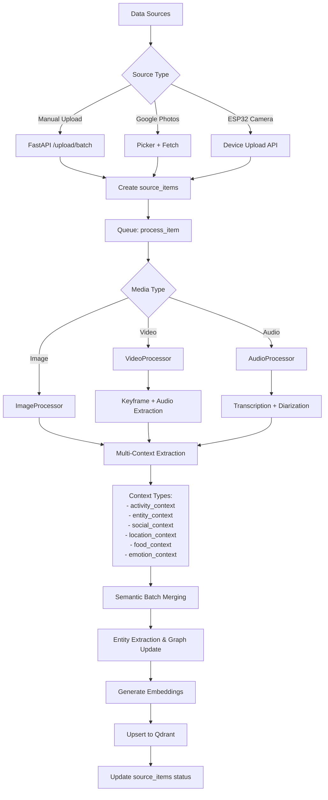

# Lifelog AI - Updated Architecture & Implementation Plan

## 1. Data Ingestion Pipeline (Weeks 3-4)

### 1.1 Unified Processing Flow



### 1.2 Enhanced Data Model

```python
# New context types for life logging
class LifelogContextType(str, Enum):
    ACTIVITY = "activity_context"      # What user was doing
    ENTITY = "entity_context"          # People, places, objects
    SOCIAL = "social_context"          # Social interactions
    LOCATION = "location_context"      # Place-based memories
    FOOD = "food_context"             # Meals, restaurants
    EMOTION = "emotion_context"        # Mood, feelings
    HEALTH = "health_context"         # Exercise, sleep (from wearables)
    KNOWLEDGE = "knowledge_context"    # Documents, notes

# Enhanced ProcessedContext
class ProcessedContext(BaseModel):
    id: str
    user_id: str
    source_item_id: str  # Links back to original photo/video
    
    context_type: LifelogContextType
    
    # Core extracted data (inspired by MineContext)
    title: str           # "Lunch at Cafe Blue"
    summary: str         # "Had salmon salad with Alice, discussed trip planning"
    keywords: List[str]  # ["lunch", "cafe", "alice", "travel"]
    
    # Life-specific metadata
    activity_category: Optional[str]  # cooking, exercising, reading, socializing
    entities: List[Dict]  # [{type: "person", name: "Alice", confidence: 0.9}]
    location: Optional[Dict]  # From EXIF or entity extraction
    
    # Temporal data
    event_time: datetime  # When it happened
    duration_minutes: Optional[int]  # For merged events
    
    # Quality signals
    importance: float  # 0-1, how significant
    confidence: float  # 0-1, extraction confidence
    
    # Vectorization
    vectorize_text: str  # Combined text for embedding
    embedding: List[float]
    
    # Relationships
    merged_from_ids: List[str]  # If merged from multiple items
    merge_count: int
```

### 1.3 Image Processing Pipeline (Adapted from MineContext)

```python
# opencontext/context_processing/processor/image_processor.py equivalent

class ImageProcessor:
    def __init__(self, llm_client, embedding_client, config):
        self.llm = llm_client
        self.embedding = embedding_client
        self.batch_size = config.get("batch_size", 10)
        self.batch_timeout = config.get("batch_timeout", 30)
        self.queue = Queue()
        self.start_batch_worker()
    
    async def process(self, source_item: SourceItem) -> List[ProcessedContext]:
        """Process single image, extract multiple contexts"""
        
        # 1. Load image + EXIF
        image_data = await self.load_image(source_item.original_url)
        exif = extract_exif(image_data)
        
        # 2. Add to batch queue
        batch_id = await self.enqueue_for_batch(source_item, image_data, exif)
        
        # Wait for batch processing
        return await self.wait_for_batch_result(batch_id)
    
    async def process_batch(self, batch: List[Dict]):
        """Process batch of images with single VLM call"""
        
        # 1. Build VLM prompt with multiple images
        messages = [
            {"role": "system", "content": LIFELOG_IMAGE_ANALYSIS_PROMPT},
            {
                "role": "user",
                "content": [
                    {"type": "text", "text": f"Analyze these {len(batch)} images:"},
                    *[{
                        "type": "image_url",
                        "image_url": {"url": f"data:image/jpeg;base64,{item['b64']}"}
                    } for item in batch]
                ]
            }
        ]
        
        # 2. Call VLM (Gemini Vision / GPT-4V)
        response = await self.llm.chat(messages, response_format="json")
        
        # 3. Parse response - expect multiple contexts per image
        extracted = parse_vlm_response(response)
        # Format: {
        #   "image_0": {
        #     "contexts": [
        #       {
        #         "context_type": "activity_context",
        #         "title": "Cooking dinner",
        #         "summary": "Making pasta in kitchen...",
        #         "activity_category": "cooking",
        #         "entities": [...],
        #         "importance": 0.7,
        #         "confidence": 0.9
        #       },
        #       {
        #         "context_type": "food_context",
        #         "title": "Homemade carbonara",
        #         ...
        #       }
        #     ]
        #   }
        # }
        
        # 4. Create ProcessedContext objects
        all_contexts = []
        for idx, item in enumerate(batch):
            source_item = item['source_item']
            contexts = extracted[f"image_{idx}"]["contexts"]
            
            for ctx in contexts:
                processed = ProcessedContext(
                    id=generate_id(),
                    user_id=source_item.user_id,
                    source_item_id=source_item.id,
                    context_type=ctx["context_type"],
                    title=ctx["title"],
                    summary=ctx["summary"],
                    keywords=ctx.get("keywords", []),
                    activity_category=ctx.get("activity_category"),
                    entities=ctx.get("entities", []),
                    location=item.get("exif", {}).get("location"),
                    event_time=source_item.captured_at,
                    importance=ctx["importance"],
                    confidence=ctx["confidence"],
                    vectorize_text=f"{ctx['title']}. {ctx['summary']}",
                    merged_from_ids=[source_item.id],
                    merge_count=1
                )
                all_contexts.append(processed)
        
        # 5. Semantic merging (inspired by MineContext)
        merged_contexts = await self.semantic_merge(all_contexts)
        
        # 6. Entity extraction and graph update
        await self.update_entity_graph(merged_contexts)
        
        # 7. Generate embeddings
        for ctx in merged_contexts:
            ctx.embedding = await self.embedding.embed(ctx.vectorize_text)
        
        return merged_contexts

    async def semantic_merge(self, contexts: List[ProcessedContext]) -> List[ProcessedContext]:
        """Merge similar contexts from same time window"""
        
        # Group by context_type and time window (2 hours)
        groups = self.group_contexts_by_type_and_time(contexts, window_hours=2)
        
        merged = []
        for group in groups:
            if len(group) == 1:
                merged.append(group[0])
                continue
            
            # Use LLM to decide merge strategy
            merge_prompt = build_merge_prompt(group)
            merge_result = await self.llm.chat(merge_prompt, response_format="json")
            
            # Process merge decisions
            for decision in merge_result["decisions"]:
                if decision["merge_type"] == "merged":
                    # Create merged context
                    merged_ctx = self.create_merged_context(
                        contexts=[group[i] for i in decision["merged_indices"]],
                        merged_data=decision["data"]
                    )
                    merged.append(merged_ctx)
                elif decision["merge_type"] == "keep_separate":
                    merged.extend([group[i] for i in decision["indices"]])
        
        return merged
```

## 2. Life Activity Classification System

### 2.1 Activity Categories

```python
class LifeActivity(str, Enum):
    # Daily routines
    SLEEPING = "sleeping"
    EATING = "eating"
    COOKING = "cooking"
    CLEANING = "cleaning"
    
    # Work & Learning
    WORKING = "working"
    STUDYING = "studying"
    READING = "reading"
    WRITING = "writing"
    
    # Physical
    EXERCISING = "exercising"
    WALKING = "walking"
    RUNNING = "running"
    SPORTS = "sports"
    
    # Social
    CHATTING = "chatting"
    MEETING = "meeting"
    SOCIALIZING = "socializing"
    CALLING = "calling"
    
    # Entertainment
    WATCHING_TV = "watching_tv"
    GAMING = "gaming"
    LISTENING_MUSIC = "listening_music"
    
    # Creative
    DRAWING = "drawing"
    PHOTOGRAPHY = "photography"
    CRAFTING = "crafting"
    
    # Other
    COMMUTING = "commuting"
    SHOPPING = "shopping"
    TRAVELING = "traveling"
    RELAXING = "relaxing"
```

### 2.2 VLM Analysis Prompt (Replace MineContext work prompts)

```yaml
# config/prompts.yaml

lifelog_image_analysis: |
  You are analyzing personal life photos to help the user remember their daily activities.
  
  For each image, extract:
  
  1. **activity_context** (REQUIRED):
     - title: Short phrase (e.g., "Lunch at cafe")
     - summary: 2-3 sentences describing what's happening
     - activity_category: One of [sleeping, eating, cooking, cleaning, working, studying, 
       reading, writing, exercising, walking, running, sports, chatting, meeting, 
       socializing, calling, watching_tv, gaming, listening_music, drawing, photography, 
       crafting, commuting, shopping, traveling, relaxing]
     - importance: 0-1 (how memorable is this moment)
     - confidence: 0-1 (how confident are you)
  
  2. **entity_context** (if people, places, or significant objects visible):
     - Extract: people (names if recognizable, or "person_1"), places (restaurants, parks), 
       objects (food items, books, exercise equipment)
     - For each entity: {type, name, confidence}
  
  3. **social_context** (if social interaction detected):
     - title: "Dinner with friends"
     - summary: Who, where, what activity
     - entities: People involved
  
  4. **food_context** (if food/meal visible):
     - title: Meal name or description
     - summary: What food, where
     - entities: Food items, restaurant
  
  5. **emotion_context** (if mood/emotion detectable):
     - title: Emotional state
     - summary: Contextual description
  
  Guidelines:
  - Always create at least one activity_context
  - Be specific but concise
  - Use present tense for summaries
  - Don't invent details not visible in image
  - Rate importance based on:
    * Special occasions (birthdays, celebrations) → 0.9-1.0
    * Social activities → 0.7-0.9
    * Regular meals/activities → 0.5-0.7
    * Mundane moments → 0.2-0.5
  
  Return JSON:
  {
    "image_0": {
      "contexts": [
        {
          "context_type": "activity_context",
          "title": "Morning jog in park",
          "summary": "Running on trail, sunny weather, wearing blue jacket",
          "activity_category": "running",
          "entities": [
            {"type": "place", "name": "Central Park", "confidence": 0.8},
            {"type": "object", "name": "running shoes", "confidence": 0.9}
          ],
          "importance": 0.6,
          "confidence": 0.95
        },
        ...
      ]
    },
    "image_1": { ... }
  }

lifelog_batch_merging: |
  You are merging multiple life activity contexts from the same time period.
  
  Given contexts from a 2-hour window, decide:
  1. Which contexts represent the same continuous activity (merge them)
  2. Which contexts are distinct events (keep separate)
  
  For merged contexts:
  - Combine summaries into richer description
  - Merge entity lists (deduplicate)
  - Update duration based on time span
  - Keep highest importance score
  - Average confidence scores
  
  Example merge decision:
  Input: 3 "cooking" contexts from 6-7pm
  Output: 1 merged "Cooking dinner" context with:
    - Combined summary mentioning all dishes
    - All ingredients/tools as entities
    - Duration: 60 minutes
    - importance: max(0.7, 0.6, 0.7) = 0.7
  
  Return JSON:
  {
    "decisions": [
      {
        "merge_type": "merged",
        "merged_indices": [0, 1, 2],
        "data": {
          "title": "Cooking Italian dinner",
          "summary": "Prepared pasta carbonara and tiramisu...",
          "entities": [...],
          "duration_minutes": 60,
          "importance": 0.7,
          "confidence": 0.85
        }
      },
      {
        "merge_type": "keep_separate",
        "indices": [3]
      }
    ]
  }
```

## 3. RAG Chat System (Weeks 7-8)

### 3.1 Tool Definitions (Adapted from MineContext)

```python
# services/api/tools/lifelog_tools.py

LIFELOG_RETRIEVAL_TOOLS = [
    {
        "type": "function",
        "function": {
            "name": "retrieve_activities",
            "description": "Search for activities by description, category, or time range. Use for 'What did I do...', 'When did I...' queries.",
            "parameters": {
                "type": "object",
                "properties": {
                    "query": {
                        "type": "string",
                        "description": "Natural language query or activity description"
                    },
                    "activity_categories": {
                        "type": "array",
                        "items": {"type": "string"},
                        "description": "Filter by categories: cooking, exercising, reading, etc."
                    },
                    "time_range": {
                        "type": "object",
                        "properties": {
                            "start": {"type": "string", "format": "date-time"},
                            "end": {"type": "string", "format": "date-time"}
                        }
                    },
                    "top_k": {"type": "integer", "default": 10}
                }
            }
        }
    },
    {
        "type": "function",
        "function": {
            "name": "retrieve_people_interactions",
            "description": "Find memories with specific people. Use for 'Who did I see...', 'What did I discuss with...' queries.",
            "parameters": {
                "type": "object",
                "properties": {
                    "person_name": {"type": "string"},
                    "query": {"type": "string", "description": "Optional context query"},
                    "time_range": {"type": "object"}
                }
            }
        }
    },
    {
        "type": "function",
        "function": {
            "name": "retrieve_food_meals",
            "description": "Search for meals, food items, restaurants. Use for 'What did I eat...', 'Where did I have...' queries.",
            "parameters": {
                "type": "object",
                "properties": {
                    "query": {"type": "string"},
                    "time_range": {"type": "object"}
                }
            }
        }
    },
    {
        "type": "function",
        "function": {
            "name": "retrieve_location_memories",
            "description": "Find memories at specific places. Use for 'What did I do at...', 'When was I at...' queries.",
            "parameters": {
                "type": "object",
                "properties": {
                    "location_name": {"type": "string"},
                    "query": {"type": "string"},
                    "time_range": {"type": "object"}
                }
            }
        }
    },
    {
        "type": "function",
        "function": {
            "name": "retrieve_daily_summaries",
            "description": "Get high-level daily summaries. Use for 'What happened on...', 'Summarize my week' queries.",
            "parameters": {
                "type": "object",
                "properties": {
                    "date": {"type": "string", "format": "date"},
                    "date_range": {
                        "type": "object",
                        "properties": {
                            "start": {"type": "string"},
                            "end": {"type": "string"}
                        }
                    }
                }
            }
        }
    },
    {
        "type": "function",
        "function": {
            "name": "aggregate_activity_stats",
            "description": "Calculate statistics about activities. Use for 'How many hours...', 'How often did I...' queries.",
            "parameters": {
                "type": "object",
                "properties": {
                    "activity_category": {"type": "string"},
                    "time_range": {"type": "object"},
                    "aggregation": {
                        "type": "string",
                        "enum": ["total_duration", "frequency", "daily_average"]
                    }
                }
            }
        }
    }
]
```

### 3.2 Chat Workflow (Inspired by MineContext ContextAgent)

```python
# services/api/chat/lifelog_agent.py

class LifelogChatAgent:
    def __init__(self, llm_client, qdrant_client, db):
        self.llm = llm_client
        self.qdrant = qdrant_client
        self.db = db
        self.max_tool_calls_per_round = 5
        self.max_rounds = 2
    
    async def chat(self, user_id: str, message: str, session_id: str):
        # 1. Intent classification
        intent = await self.classify_intent(message)
        
        if intent == "simple_chat":
            return await self.simple_response(message)
        
        # 2. Context retrieval phase (like MineContext ContextNode)
        collected_contexts = []
        for round in range(self.max_rounds):
            # Plan tool calls
            tool_plan = await self.plan_tool_calls(
                query=message,
                intent=intent,
                previous_contexts=collected_contexts
            )
            
            # Execute tools in parallel
            tool_results = await asyncio.gather(*[
                self.execute_tool(call) for call in tool_plan[:self.max_tool_calls_per_round]
            ])
            
            # Filter and add to context
            filtered = await self.filter_tool_results(tool_results, message)
            collected_contexts.extend(filtered)
            
            # Check if sufficient
            if await self.is_context_sufficient(collected_contexts, message):
                break
        
        # 3. Generate response (like MineContext ExecutorNode)
        response = await self.generate_response(
            query=message,
            contexts=collected_contexts,
            intent=intent
        )
        
        return response
    
    async def plan_tool_calls(self, query, intent, previous_contexts):
        """Use LLM to plan which tools to call"""
        prompt = f"""
        User query: {query}
        Intent: {intent}
        
        Available tools: {json.dumps(LIFELOG_RETRIEVAL_TOOLS)}
        
        Previous round retrieved: {len(previous_contexts)} contexts
        
        Plan 3-5 tool calls to gather relevant information.
        Consider:
        - Time references (yesterday, last week, etc.)
        - People/entity mentions
        - Activity types
        - Need for statistics vs specific memories
        
        Return JSON array of tool calls:
        [
          {{"name": "retrieve_activities", "arguments": {{"query": "...", "time_range": ...}}}},
          ...
        ]
        """
        
        plan = await self.llm.chat([{"role": "user", "content": prompt}], response_format="json")
        return parse_tool_plan(plan)
    
    async def execute_tool(self, tool_call: Dict) -> Dict:
        """Execute a single retrieval tool"""
        tool_name = tool_call["name"]
        args = tool_call["arguments"]
        
        if tool_name == "retrieve_activities":
            return await self.retrieve_activities(**args)
        elif tool_name == "retrieve_people_interactions":
            return await self.retrieve_people_interactions(**args)
        elif tool_name == "retrieve_food_meals":
            return await self.retrieve_food_meals(**args)
        # ... other tools
    
    async def retrieve_activities(self, query: str, activity_categories: List[str] = None, 
                                  time_range: Dict = None, top_k: int = 10):
        """Vector search + filter for activity contexts"""
        
        # Embed query
        query_vector = await self.embedding.embed(query)
        
        # Build Qdrant filter
        filters = {
            "must": [
                {"key": "user_id", "match": {"value": user_id}},
                {"key": "context_type", "match": {"value": "activity_context"}}
            ]
        }
        
        if activity_categories:
            filters["must"].append({
                "key": "activity_category",
                "match": {"any": activity_categories}
            })
        
        if time_range:
            filters["must"].append({
                "key": "event_time_ts",
                "range": {
                    "gte": time_range["start"],
                    "lte": time_range["end"]
                }
            })
        
        # Search
        results = await self.qdrant.search(
            collection_name=f"user_{user_id}",
            query_vector=query_vector,
            query_filter=filters,
            limit=top_k
        )
        
        return {
            "tool": "retrieve_activities",
            "results": results,
            "count": len(results)
        }
```

### 3.3 Response Generation Prompt

```yaml
lifelog_answer_generation: |
  You are the user's personal memory assistant. Answer based ONLY on the retrieved contexts below.
  
  Retrieved Contexts:
  {contexts}
  
  User Question: {query}
  
  Guidelines:
  - Use warm, conversational tone
  - Reference specific memories with dates/times
  - If multiple relevant memories, summarize or list chronologically
  - If insufficient info, say so clearly
  - For stats questions (how many hours, how often), calculate from context durations
  - Include relevant details (who, where, what) but stay concise
  
  Example responses:
  
  Q: "What did I eat yesterday?"
  A: "Yesterday you had quite a varied day! For breakfast around 8am, you made scrambled eggs and toast at home. Lunch was at Cafe Blue around 1pm where you had the salmon salad with Alice. For dinner at 7pm, you cooked pasta carbonara at home - the photos show you really took your time with it!"
  
  Q: "How many hours did I spend reading last week?"
  A: "Based on your photos from last week, I found 4 distinct reading sessions totaling about 6.5 hours:
  - Monday evening: 2 hours (sci-fi novel in living room)
  - Wednesday morning: 1.5 hours (articles at cafe)
  - Friday night: 2 hours (continued the novel)
  - Sunday afternoon: 1 hour (magazine on patio)"
  
  Q: "Who did I talk with about travel planning?"
  A: "You discussed travel planning with Alice during lunch at Cafe Blue on Nov 1st. The conversation came up while you were both eating - she mentioned some ideas for a trip and you seemed pretty engaged in the discussion based on the photos from that meal."
```

## 4. Updated Database Schema

```sql
-- Enhanced processed_content table
CREATE TABLE processed_content (
  id UUID PRIMARY KEY,
  source_item_id UUID REFERENCES source_items(id),
  user_id UUID REFERENCES users(id),
  
  -- Context classification
  context_type TEXT NOT NULL, -- activity_context, entity_context, etc.
  
  -- Core extracted data
  title TEXT NOT NULL,
  summary TEXT NOT NULL,
  keywords TEXT[], -- Array of keywords
  
  -- Life-specific fields
  activity_category TEXT, -- cooking, exercising, reading, etc.
  entities JSONB, -- [{type, name, confidence}, ...]
  location JSONB, -- {lat, lng, place_name, from_exif}
  
  -- Temporal
  event_time TIMESTAMP NOT NULL,
  duration_minutes INTEGER,
  
  -- Quality signals
  importance FLOAT DEFAULT 0.5,
  confidence FLOAT DEFAULT 0.5,
  
  -- Merging tracking
  merged_from_ids UUID[],
  merge_count INTEGER DEFAULT 1,
  
  -- Vectorization (also stored in Qdrant)
  vectorize_text TEXT NOT NULL,
  
  created_at TIMESTAMP DEFAULT now(),
  updated_at TIMESTAMP DEFAULT now()
);

CREATE INDEX idx_processed_content_user_context_type ON processed_content(user_id, context_type);
CREATE INDEX idx_processed_content_event_time ON processed_content(user_id, event_time DESC);
CREATE INDEX idx_processed_content_activity ON processed_content(user_id, activity_category);

-- Daily events table (for summarized events)
CREATE TABLE daily_events (
  id UUID PRIMARY KEY,
  user_id UUID REFERENCES users(id),
  event_date DATE NOT NULL,
  
  title TEXT NOT NULL,
  summary TEXT NOT NULL,
  
  start_time TIMESTAMP,
  end_time TIMESTAMP,
  duration_minutes INTEGER,
  
  activity_category TEXT,
  location JSONB,
  
  -- References to contexts that compose this event
  source_context_ids UUID[],
  
  importance FLOAT DEFAULT 0.5,
  
  created_at TIMESTAMP DEFAULT now(),
  
  UNIQUE(user_id, event_date, title)
);

-- Daily summaries table
CREATE TABLE daily_summaries (
  id UUID PRIMARY KEY,
  user_id UUID REFERENCES users(id),
  summary_date DATE NOT NULL,
  
  content_markdown TEXT NOT NULL,
  
  -- References
  source_event_ids UUID[],
  
  created_at TIMESTAMP DEFAULT now(),
  
  UNIQUE(user_id, summary_date)
);
```

## 5. Updated Implementation Timeline

### Week 3-4: Core Ingestion (NOW)

**Priority 1: Image Processing Pipeline**
- [ ] Implement `ImageProcessor` with batch queuing
- [ ] Write lifelog VLM analysis prompt
- [ ] Test with 100 sample photos (varied activities)
- [ ] Implement semantic merging logic
- [ ] Store multiple contexts per image in `processed_content`

**Priority 2: Video Processing**
- [ ] Keyframe extraction (ffmpeg every 3s)
- [ ] Pass keyframes through image pipeline
- [ ] Audio transcription (Whisper)
- [ ] Merge video contexts with activity timeline

**Priority 3: Manual Upload**
- [ ] Batch upload endpoint with progress tracking
- [ ] Queue processing tasks
- [ ] Display processing status in UI

### Week 5-6: Entity & Event Systems

**Priority 1: Entity Extraction**
- [ ] Adapt MineContext entity processor for people/places/food/objects
- [ ] Build entity graph in `memory_nodes` and `memory_edges`
- [ ] Implement entity resolution (same person across photos)
- [ ] Face clustering for person identification (optional, can use external service)

**Priority 2: Event Clustering**
- [ ] Nightly job to cluster contexts into daily events
- [ ] Time-based clustering (2-hour windows)
- [ ] Generate event summaries with LLM
- [ ] Link events to entities in graph

**Priority 3: Daily Summary Generation**
- [ ] Scheduled task (2am) to generate previous day summary
- [ ] Narrative summary from contexts + events
- [ ] Store in `daily_summaries` table
- [ ] Embed summaries for retrieval

### Week 7-8: RAG Chat System

**Priority 1: Tool-Based Retrieval**
- [ ] Define 12+ retrieval tools (activities, people, food, locations, summaries, stats)
- [ ] Implement tool execution functions
- [ ] Build query → embedding → Qdrant search pipeline
- [ ] Add temporal/entity/category filters

**Priority 2: Chat Agent**
- [ ] Intent classification (simple_chat vs qa_analysis vs stats_query)
- [ ] Tool planning with LLM (3-5 tools per round, max 2 rounds)
- [ ] Context collection and filtering
- [ ] Response generation with citations

**Priority 3: Chat UI**
- [ ] Message list with auto-scroll
- [ ] Input with "Ask about your memories..." placeholder
- [ ] Source citation cards (thumbnail + snippet + timestamp)
- [ ] Session management (new chat, history sidebar)

**Priority 4: Daily Summary UI**
- [ ] Dashboard widget showing recent daily summaries
- [ ] Sidebar in chat showing relevant daily summaries
- [ ] "Pin to context" action to include summary in chat

---

## 6. ESP32 Camera Integration (Post-MVP, but design now)

### 6.1 Device Architecture

```
ESP32 Camera (XIAO ESP32S3 Sense)
    â†"
Capture JPEG every 30s → SD Card
    â†"
When WiFi available (phone hotspot)
    â†"
Upload backlog via device API
    â†"
Same processing pipeline as manual uploads
```

### 6.2 Device API Design

```python
# services/api/routes/device.py

@app.post("/devices/pair")
async def pair_device(user: User = Depends(get_current_user)):
    """User initiates device pairing"""
    device_id = generate_id()
    pairing_code = generate_pairing_code()  # 6-digit code, expires in 10min
    
    await db.insert(devices, {
        "id": device_id,
        "user_id": user.id,
        "pairing_code_hash": hash_code(pairing_code),
        "pairing_expires_at": datetime.utcnow() + timedelta(minutes=10),
        "status": "pending"
    })
    
    return {
        "device_id": device_id,
        "pairing_code": pairing_code,
        "expires_in_seconds": 600
    }

@app.post("/devices/activate")
async def activate_device(pairing_code: str):
    """Device activates using pairing code"""
    device = await db.query(devices).filter(
        pairing_code_hash=hash_code(pairing_code),
        status="pending",
        pairing_expires_at > datetime.utcnow()
    ).first()
    
    if not device:
        raise HTTPException(status_code=400, detail="Invalid or expired pairing code")
    
    # Generate long-lived device token
    device_token = generate_device_token()
    
    await db.update(devices, device.id, {
        "device_token_hash": hash_token(device_token),
        "status": "active",
        "activated_at": datetime.utcnow()
    })
    
    return {
        "device_token": device_token,
        "upload_endpoint": "/devices/upload-url"
    }

@app.post("/devices/upload-url")
async def get_device_upload_url(
    filename: str,
    device: Device = Depends(authenticate_device)
):
    """Device gets presigned URL for upload"""
    object_key = f"devices/{device.id}/{generate_id()}/{filename}"
    
    presigned_url = await storage.create_presigned_upload_url(
        bucket="user-uploads",
        key=object_key,
        expires_in=3600
    )
    
    return {
        "upload_url": presigned_url,
        "object_key": object_key
    }

@app.post("/devices/ingest")
async def ingest_device_upload(
    object_key: str,
    captured_at: datetime,
    device: Device = Depends(authenticate_device)
):
    """Device notifies that upload is complete"""
    
    # Create source_item
    item_id = await db.insert(source_items, {
        "id": generate_id(),
        "user_id": device.user_id,
        "provider": "esp32_camera",
        "external_id": object_key,
        "item_type": "photo",
        "original_url": object_key,
        "captured_at": captured_at,
        "metadata": {"device_id": device.id},
        "processing_status": "pending"
    })
    
    # Queue processing
    await celery.send_task("process_item", args=[item_id])
    
    return {"item_id": item_id, "status": "queued"}
```

### 6.3 ESP32 Firmware Flow (Arduino)

```cpp
// pseudo-code for ESP32 camera firmware

void setup() {
  camera_config_t config;
  config.frame_size = FRAMESIZE_SVGA;  // 800x600
  config.jpeg_quality = 12;
  
  esp_camera_init(&config);
  
  SD.begin();
  WiFi.begin(ssid, password);
}

void loop() {
  // Capture every 30s
  if (millis() - lastCapture > 30000) {
    capture_and_save_to_sd();
    lastCapture = millis();
  }
  
  // Upload when WiFi connected and SD has files
  if (WiFi.status() == WL_CONNECTED && SD_has_files()) {
    upload_backlog();
  }
  
  delay(1000);
}

void upload_backlog() {
  File root = SD.open("/captures");
  
  while (File file = root.openNextFile()) {
    // 1. Get presigned URL
    String filename = file.name();
    HTTPClient http;
    http.begin(API_URL "/devices/upload-url");
    http.addHeader("X-Device-Token", DEVICE_TOKEN);
    http.addHeader("Content-Type", "application/json");
    
    String payload = "{\"filename\":\"" + filename + "\"}";
    int httpCode = http.POST(payload);
    
    if (httpCode == 200) {
      DynamicJsonDocument doc(1024);
      deserializeJson(doc, http.getString());
      String uploadUrl = doc["upload_url"];
      String objectKey = doc["object_key"];
      
      // 2. Upload file to presigned URL
      HTTPClient uploadHttp;
      uploadHttp.begin(uploadUrl);
      uploadHttp.addHeader("Content-Type", "image/jpeg");
      
      uint8_t* buffer = new uint8_t[file.size()];
      file.read(buffer, file.size());
      
      int uploadCode = uploadHttp.PUT(buffer, file.size());
      delete[] buffer;
      
      if (uploadCode == 200) {
        // 3. Notify backend
        http.begin(API_URL "/devices/ingest");
        http.addHeader("X-Device-Token", DEVICE_TOKEN);
        http.addHeader("Content-Type", "application/json");
        
        String ingestPayload = "{\"object_key\":\"" + objectKey + 
                               "\",\"captured_at\":\"" + get_file_timestamp(file) + "\"}";
        http.POST(ingestPayload);
        
        // 4. Delete from SD
        SD.remove(file.name());
      }
    }
    
    file.close();
  }
}
```

---

## 7. Video Processing Pipeline (Week 4)

### 7.1 Video Processor Implementation

```python
# services/api/processors/video_processor.py

class VideoProcessor:
    def __init__(self, llm_client, embedding_client, config):
        self.llm = llm_client
        self.embedding = embedding_client
        self.keyframe_interval = config.get("keyframe_interval_sec", 3)
        self.image_processor = ImageProcessor(llm_client, embedding_client, config)
    
    async def process(self, source_item: SourceItem) -> List[ProcessedContext]:
        """Process video: keyframes + audio transcription"""
        
        # 1. Download video
        video_path = await self.download_video(source_item.original_url)
        
        # 2. Extract keyframes (every 3 seconds)
        keyframes = await self.extract_keyframes(video_path, self.keyframe_interval)
        # Returns: [(timestamp, image_data), ...]
        
        # 3. Detect scene boundaries
        scenes = await self.detect_scenes(keyframes)
        # Groups keyframes into scenes using scene detection
        
        # 4. Process keyframes as images (reuse ImageProcessor)
        all_contexts = []
        for scene_keyframes in scenes:
            # Create temporary source_items for each keyframe
            temp_items = []
            for ts, img_data in scene_keyframes:
                temp_item = SourceItem(
                    id=generate_id(),
                    user_id=source_item.user_id,
                    item_type="photo",
                    captured_at=source_item.captured_at + timedelta(seconds=ts),
                    original_url=None,  # In-memory
                    metadata={"from_video": source_item.id, "timestamp": ts}
                )
                temp_items.append((temp_item, img_data))
            
            # Batch process scene keyframes
            scene_contexts = await self.image_processor.process_batch([
                {"source_item": item, "image_data": img, "exif": {}}
                for item, img in temp_items
            ])
            
            all_contexts.extend(scene_contexts)
        
        # 5. Extract and transcribe audio
        audio_path = await self.extract_audio(video_path)
        transcript = await self.transcribe_audio(audio_path)
        
        if transcript:
            # Create transcript context
            transcript_context = ProcessedContext(
                id=generate_id(),
                user_id=source_item.user_id,
                source_item_id=source_item.id,
                context_type="knowledge_context",  # Transcript as knowledge
                title=f"Video transcript: {source_item.metadata.get('title', 'Untitled')}",
                summary=transcript,
                keywords=extract_keywords(transcript),
                event_time=source_item.captured_at,
                importance=0.6,
                confidence=0.85,
                vectorize_text=transcript,
                merged_from_ids=[source_item.id],
                merge_count=1
            )
            all_contexts.append(transcript_context)
        
        # 6. Generate video-level summary from all contexts
        video_summary = await self.generate_video_summary(
            contexts=all_contexts,
            transcript=transcript,
            duration=source_item.metadata.get("duration_seconds")
        )
        
        video_summary_context = ProcessedContext(
            id=generate_id(),
            user_id=source_item.user_id,
            source_item_id=source_item.id,
            context_type="activity_context",
            title=video_summary["title"],
            summary=video_summary["summary"],
            keywords=video_summary["keywords"],
            activity_category=video_summary["activity_category"],
            entities=video_summary["entities"],
            event_time=source_item.captured_at,
            duration_minutes=source_item.metadata.get("duration_seconds", 0) // 60,
            importance=0.8,  # Videos generally more important
            confidence=0.9,
            vectorize_text=f"{video_summary['title']}. {video_summary['summary']}",
            merged_from_ids=[source_item.id],
            merge_count=1
        )
        
        all_contexts.append(video_summary_context)
        
        # 7. Generate embeddings
        for ctx in all_contexts:
            ctx.embedding = await self.embedding.embed(ctx.vectorize_text)
        
        return all_contexts
    
    async def extract_keyframes(self, video_path: str, interval_sec: int) -> List[Tuple[float, bytes]]:
        """Extract keyframes using ffmpeg"""
        import subprocess
        import tempfile
        
        output_dir = tempfile.mkdtemp()
        
        # ffmpeg command to extract frames
        cmd = [
            "ffmpeg",
            "-i", video_path,
            "-vf", f"fps=1/{interval_sec}",  # 1 frame every N seconds
            "-q:v", "2",  # High quality
            f"{output_dir}/frame_%04d.jpg"
        ]
        
        subprocess.run(cmd, check=True, capture_output=True)
        
        # Read frames
        frames = []
        for i, filename in enumerate(sorted(os.listdir(output_dir))):
            timestamp = i * interval_sec
            with open(os.path.join(output_dir, filename), "rb") as f:
                frames.append((timestamp, f.read()))
        
        # Cleanup
        shutil.rmtree(output_dir)
        
        return frames
    
    async def detect_scenes(self, keyframes: List[Tuple[float, bytes]]) -> List[List[Tuple[float, bytes]]]:
        """Group keyframes into scenes using PySceneDetect"""
        from scenedetect import detect, ContentDetector
        
        # For simplicity, group every 3-5 consecutive keyframes as a scene
        # In production, use proper scene detection
        scenes = []
        current_scene = []
        
        for frame in keyframes:
            current_scene.append(frame)
            if len(current_scene) >= 5:
                scenes.append(current_scene)
                current_scene = []
        
        if current_scene:
            scenes.append(current_scene)
        
        return scenes
    
    async def transcribe_audio(self, audio_path: str) -> str:
        """Transcribe audio using Whisper"""
        import whisper
        
        model = whisper.load_model("base")
        result = model.transcribe(audio_path)
        
        return result["text"]
    
    async def generate_video_summary(self, contexts: List[ProcessedContext], 
                                    transcript: str, duration: int) -> Dict:
        """Generate overall video summary from contexts + transcript"""
        
        prompt = f"""
        Summarize this {duration}s video based on visual analysis and audio transcript.
        
        Visual contexts extracted:
        {json.dumps([ctx.dict() for ctx in contexts[:20]], default=str, indent=2)}
        
        Audio transcript:
        {transcript[:1000] if transcript else "No audio"}
        
        Generate:
        - title: Short descriptive title (e.g., "Morning workout routine")
        - summary: 2-3 sentence summary of video content
        - activity_category: Main activity type
        - keywords: 5-10 relevant keywords
        - entities: People, places, objects mentioned or visible
        
        Return JSON.
        """
        
        response = await self.llm.chat([{
            "role": "user",
            "content": prompt
        }], response_format="json")
        
        return json.loads(response)
```

---

## 8. Audio Processing Pipeline (Week 4)

### 8.1 Audio Processor Implementation

```python
# services/api/processors/audio_processor.py

class AudioProcessor:
    def __init__(self, llm_client, embedding_client, config):
        self.llm = llm_client
        self.embedding = embedding_client
    
    async def process(self, source_item: SourceItem) -> List[ProcessedContext]:
        """Process audio: transcription + diarization + summarization"""
        
        # 1. Download audio
        audio_path = await self.download_audio(source_item.original_url)
        
        # 2. Transcribe with Whisper
        transcript_data = await self.transcribe_with_diarization(audio_path)
        # Returns: {
        #   "text": "full transcript",
        #   "segments": [{"start": 0, "end": 5.2, "speaker": "SPEAKER_00", "text": "..."}]
        # }
        
        # 3. Generate summary
        summary = await self.generate_audio_summary(
            transcript=transcript_data["text"],
            segments=transcript_data["segments"],
            duration=source_item.metadata.get("duration_seconds")
        )
        
        contexts = []
        
        # 4. Create transcript context (full text for search)
        transcript_context = ProcessedContext(
            id=generate_id(),
            user_id=source_item.user_id,
            source_item_id=source_item.id,
            context_type="knowledge_context",
            title=f"Audio recording: {source_item.metadata.get('title', 'Untitled')}",
            summary=transcript_data["text"],
            keywords=extract_keywords(transcript_data["text"]),
            event_time=source_item.captured_at,
            duration_minutes=source_item.metadata.get("duration_seconds", 0) // 60,
            importance=0.7,
            confidence=0.85,
            vectorize_text=transcript_data["text"],
            merged_from_ids=[source_item.id],
            merge_count=1
        )
        contexts.append(transcript_context)
        
        # 5. Create activity context (semantic summary)
        activity_context = ProcessedContext(
            id=generate_id(),
            user_id=source_item.user_id,
            source_item_id=source_item.id,
            context_type="activity_context",
            title=summary["title"],
            summary=summary["summary"],
            keywords=summary["keywords"],
            activity_category=summary.get("activity_category", "chatting"),
            entities=summary.get("entities", []),
            event_time=source_item.captured_at,
            duration_minutes=source_item.metadata.get("duration_seconds", 0) // 60,
            importance=summary.get("importance", 0.6),
            confidence=0.8,
            vectorize_text=f"{summary['title']}. {summary['summary']}",
            merged_from_ids=[source_item.id],
            merge_count=1
        )
        contexts.append(activity_context)
        
        # 6. Generate embeddings
        for ctx in contexts:
            ctx.embedding = await self.embedding.embed(ctx.vectorize_text)
        
        return contexts
    
    async def transcribe_with_diarization(self, audio_path: str) -> Dict:
        """Transcribe with speaker diarization"""
        import whisper
        from pyannote.audio import Pipeline
        
        # Transcribe
        whisper_model = whisper.load_model("base")
        transcription = whisper_model.transcribe(audio_path)
        
        # Diarize (optional, requires pyannote)
        try:
            diarization_pipeline = Pipeline.from_pretrained("pyannote/speaker-diarization")
            diarization = diarization_pipeline(audio_path)
            
            # Merge transcription with speaker labels
            segments = []
            for segment, track, speaker in diarization.itertracks(yield_label=True):
                text = self.get_text_for_segment(
                    transcription["segments"],
                    segment.start,
                    segment.end
                )
                segments.append({
                    "start": segment.start,
                    "end": segment.end,
                    "speaker": speaker,
                    "text": text
                })
            
            return {
                "text": transcription["text"],
                "segments": segments
            }
        except:
            # Fallback without diarization
            return {
                "text": transcription["text"],
                "segments": transcription["segments"]
            }
    
    async def generate_audio_summary(self, transcript: str, segments: List[Dict], 
                                    duration: int) -> Dict:
        """Generate summary from transcript"""
        
        prompt = f"""
        Summarize this {duration}s audio recording.
        
        Transcript:
        {transcript[:2000]}
        
        Speakers: {len(set(s.get('speaker', 'SPEAKER_00') for s in segments))}
        
        Generate:
        - title: Descriptive title (e.g., "Team meeting about Q4 goals")
        - summary: 2-3 sentence summary
        - activity_category: meeting | chatting | calling | listening_music | other
        - keywords: Key topics discussed
        - entities: People mentioned, topics, decisions
        - importance: 0-1 rating
        
        Return JSON.
        """
        
        response = await self.llm.chat([{
            "role": "user",
            "content": prompt
        }], response_format="json")
        
        return json.loads(response)
```

---

## 9. Google Photos Ingestion (Week 3-4)

### 9.1 Google Photos Picker Integration

```python
# services/api/routes/integrations/google_photos.py

@app.get("/integrations/google/photos/auth-url")
async def get_google_photos_auth_url(user: User = Depends(get_current_user)):
    """Initiate OAuth flow for Google Photos"""
    
    flow = google_auth_oauthlib.flow.Flow.from_client_config(
        client_config={
            "web": {
                "client_id": settings.GOOGLE_CLIENT_ID,
                "client_secret": settings.GOOGLE_CLIENT_SECRET,
                "auth_uri": "https://accounts.google.com/o/oauth2/auth",
                "token_uri": "https://oauth2.googleapis.com/token"
            }
        },
        scopes=["https://www.googleapis.com/auth/photoslibrary.readonly"]
    )
    
    flow.redirect_uri = f"{settings.API_URL}/integrations/google/photos/callback"
    
    auth_url, state = flow.authorization_url(
        access_type="offline",
        include_granted_scopes="true",
        prompt="consent"
    )
    
    # Store state for verification
    await redis.setex(f"oauth_state:{user.id}", 600, state)
    
    return {"auth_url": auth_url}

@app.get("/integrations/google/photos/callback")
async def google_photos_callback(code: str, state: str, user: User = Depends(get_current_user)):
    """Handle OAuth callback"""
    
    # Verify state
    stored_state = await redis.get(f"oauth_state:{user.id}")
    if state != stored_state:
        raise HTTPException(status_code=400, detail="Invalid state")
    
    # Exchange code for tokens
    flow = google_auth_oauthlib.flow.Flow.from_client_config(...)
    flow.fetch_token(code=code)
    
    credentials = flow.credentials
    
    # Encrypt and store tokens
    encrypted_token = encrypt_token(credentials.to_json())
    
    connection_id = await db.insert(data_connections, {
        "id": generate_id(),
        "user_id": user.id,
        "provider": "google_photos",
        "status": "connected",
        "oauth_token_encrypted": encrypted_token,
        "last_sync_at": None,
        "total_items": 0
    })
    
    return {"connection_id": connection_id, "status": "connected"}

@app.post("/integrations/google/photos/picker-session")
async def start_picker_session(
    connection_id: str,
    user: User = Depends(get_current_user)
):
    """Start a Google Picker session"""
    
    connection = await db.get(data_connections, connection_id)
    if connection.user_id != user.id:
        raise HTTPException(status_code=403)
    
    # Get OAuth token
    credentials = get_credentials_from_connection(connection)
    
    # Return picker config
    return {
        "picker_config": {
            "client_id": settings.GOOGLE_CLIENT_ID,
            "access_token": credentials.token,
            "app_id": settings.GOOGLE_APP_ID
        }
    }

@app.post("/integrations/google/photos/ingest-selection")
async def ingest_picker_selection(
    connection_id: str,
    media_ids: List[str],
    user: User = Depends(get_current_user)
):
    """Ingest user-selected photos from Picker"""
    
    connection = await db.get(data_connections, connection_id)
    if connection.user_id != user.id:
        raise HTTPException(status_code=403)
    
    credentials = get_credentials_from_connection(connection)
    
    # Build Photos API client
    service = build("photoslibrary", "v1", credentials=credentials)
    
    ingested_count = 0
    
    for media_id in media_ids:
        # Check if already ingested
        existing = await db.query(source_items).filter(
            connection_id=connection_id,
            external_id=media_id
        ).first()
        
        if existing:
            continue
        
        # Fetch media item details
        media_item = service.mediaItems().get(mediaItemId=media_id).execute()
        
        # Download media bytes
        base_url = media_item["baseUrl"]
        download_url = f"{base_url}=d"  # Download original
        
        response = requests.get(download_url)
        media_bytes = response.content
        
        # Upload to Supabase Storage
        storage_path = f"{user.id}/google_photos/{media_id}.jpg"
        await storage.upload(storage_path, media_bytes)
        
        # Extract metadata
        metadata = {
            "google_photos_id": media_id,
            "filename": media_item.get("filename"),
            "mime_type": media_item.get("mimeType"),
            "width": media_item.get("mediaMetadata", {}).get("width"),
            "height": media_item.get("mediaMetadata", {}).get("height")
        }
        
        creation_time = parse_google_timestamp(
            media_item.get("mediaMetadata", {}).get("creationTime")
        )
        
        # Create source_item
        item_id = await db.insert(source_items, {
            "id": generate_id(),
            "user_id": user.id,
            "connection_id": connection_id,
            "provider": "google_photos",
            "external_id": media_id,
            "item_type": "photo",
            "original_url": storage_path,
            "captured_at": creation_time,
            "metadata": metadata,
            "processing_status": "pending"
        })
        
        # Queue processing
        await celery.send_task("process_item", args=[item_id])
        
        ingested_count += 1
    
    # Update connection stats
    await db.update(data_connections, connection_id, {
        "last_sync_at": datetime.utcnow(),
        "total_items": connection.total_items + ingested_count
    })
    
    return {
        "ingested_count": ingested_count,
        "skipped_count": len(media_ids) - ingested_count
    }
```

