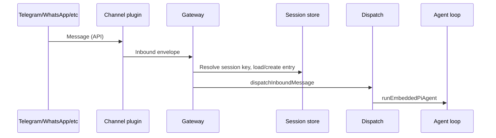
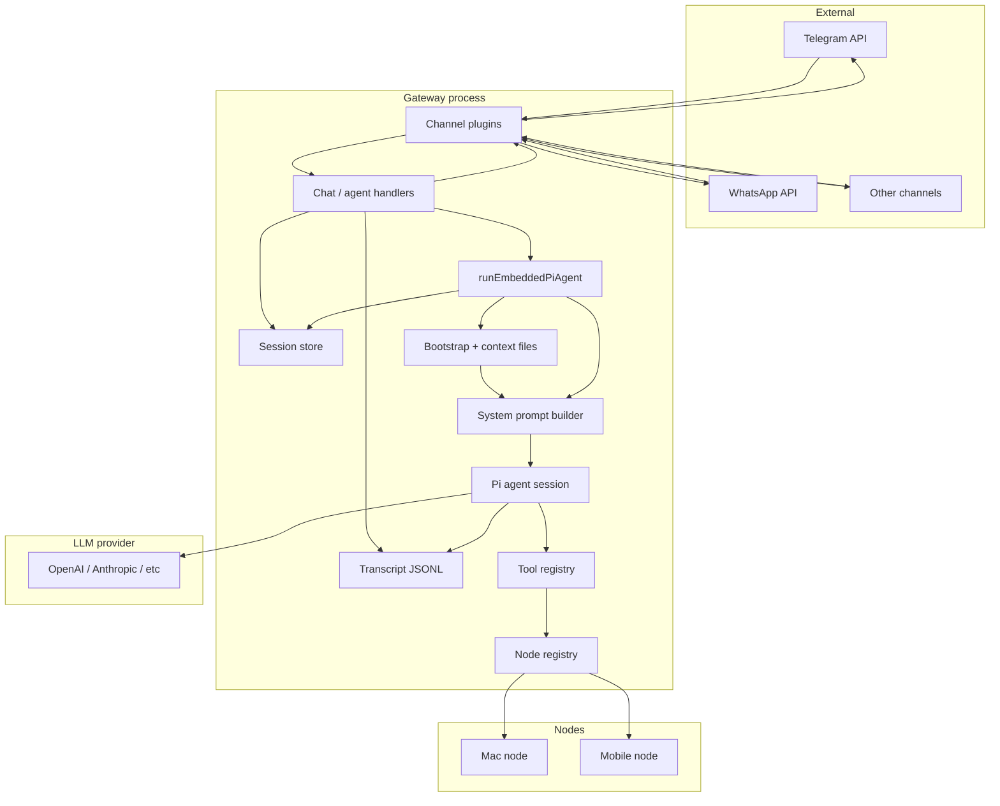

# OpenClaw architecture deep dive

Last updated: 2026-01-30

This document describes the full system architecture of OpenClaw: how the Gateway initializes, how messages flow from channels to the agent and back, how sessions and memory are persisted, and how tools and skills are executed. For a shorter overview, see [Gateway architecture](/concepts/architecture) and [Gateway execution and memory](/concepts/gateway-execution-and-memory).

## 1. Gateway core

### Initialization flow

The Gateway is a single long-lived Node process. Entry points:

- **CLI**: `openclaw gateway` invokes the gateway run command, which calls `startGatewayServer()` from [src/gateway/server.impl.ts](src/gateway/server.impl.ts).
- **macOS app**: The menubar app can start or attach to the Gateway via launchd; the Gateway process is the same binary.

Startup sequence (high level):

1. **Config**: Load and migrate config from `~/.clawdbot/openclaw.json` (or `CLAWDBOT_CONFIG_PATH`). Validate and apply plugin auto-enable.
2. **Plugins**: [loadGatewayPlugins](src/gateway/server-plugins.ts) loads gateway and channel plugins from config and extensions.
3. **Runtime state**: [createGatewayRuntimeState](src/gateway/server-runtime-state.ts) creates the HTTP server, WebSocket server, and broadcast infrastructure. The same port serves both HTTP (control UI, hooks, OpenAI-compatible endpoints) and WebSocket.
4. **Channels**: [createChannelManager](src/gateway/server-channels.ts) builds the channel manager; channels are started later based on config.
5. **Discovery**: [startGatewayDiscovery](src/gateway/server-discovery-runtime.ts) advertises the Gateway via mDNS/Bonjour (`_openclaw._tcp` / `_openclaw-gw._tcp`) for LAN and optional unicast DNS-SD for Tailscale.
6. **Node registry**: [NodeRegistry](src/gateway/node-registry.ts) tracks connected nodes (role `node`) for `node.invoke` routing.
7. **Cron**: [buildGatewayCronService](src/gateway/server-cron.ts) sets up scheduled jobs and wake events.
8. **WebSocket**: [attachGatewayWsHandlers](src/gateway/server-ws-runtime.ts) attaches the connection and message handlers to the WS server.
9. **Channels start**: Channel manager starts each configured channel (Telegram, WhatsApp, Slack, etc.).
10. **Health / maintenance**: Health snapshot refresh and maintenance timers start.

### Config hot-reload

Config hot-reload (optional) watches the config file and can apply changes without restart. Implementation: [src/gateway/server-reload-handlers.ts](src/gateway/server-reload-handlers.ts).

**Safe to hot-reload (no restart):**
- `agents.defaults.model`, `agents.defaults.thinking` — model selection
- `channels.*.allowFrom`, `channels.*.groupAllowFrom` — access control lists
- `agents.defaults.sandbox.mode`, `agents.defaults.toolPolicy` — security settings
- `cron.jobs` — scheduled job definitions
- `agents.defaults.heartbeat.*` — heartbeat interval/prompt

**Requires restart (SIGUSR1):**
- `gateway.port`, `gateway.bind` — server binding
- `gateway.auth.token`, `gateway.auth.password` — authentication
- Plugin enable/disable (gateway or channel plugins)

The Gateway listens for config file changes via chokidar. Safe changes are applied immediately; critical changes trigger an in-process restart signal.

### WebSocket connection lifecycle

Connections are handled in [src/gateway/server/ws-connection.ts](src/gateway/server/ws-connection.ts) (or equivalent under `server/`):

- **First frame**: Must be a `connect` request. Any other frame or invalid JSON closes the socket.
- **Handshake**: Gateway validates `connect.params` (protocol version, client identity, auth token or password). For pairing, it may issue a challenge; the client signs it and the Gateway approves or rejects.
- **Registration**: On success, the client is added to a `clients` set. Presence is broadcast to other clients.
- **Requests**: Subsequent frames are `req`/`res` (method + params). Methods are implemented in [src/gateway/server-methods](src/gateway/server-methods) (e.g. `agent`, `send`, `health`, `chat.history`, `node.invoke`).
- **Events**: Gateway pushes `event` frames (`agent`, `presence`, `tick`, `shutdown`, etc.) to connected clients.
- **Disconnect**: On close, the client is removed and presence is updated.

Authentication is enforced for all connections when `gateway.auth.token` or `gateway.auth.password` is set; local (loopback) connects can be auto-approved for pairing.

### Plugin system

Gateway and channel plugins are loaded from `extensions/*` and config. The registry exposes:

- **Gateway methods**: Custom RPC methods registered by plugins.
- **Channel plugins**: Each channel (Telegram, Discord, etc.) is a plugin that implements the channel interface: connect to provider API, normalize inbound messages, send replies, report status.

Plugins can also register tools, hooks, and memory backends. See [Plugins](/plugin) and [Channels](/channels).

### Gateway as background daemon

The Gateway runs as a system-managed background service, not just a shell process. Implementation: [src/daemon/](src/daemon/).

| Platform | Service Manager | Config File |
|----------|-----------------|-------------|
| **macOS** | launchd | `~/Library/LaunchAgents/dev.openclaw.gateway.plist` |
| **Linux** | systemd | `~/.config/systemd/user/openclaw-gateway.service` |
| **Windows** | Task Scheduler | Scheduled task `OpenClawGateway` |

**macOS launchd plist** includes:
```xml
<key>RunAtLoad</key>
<true/>
<key>KeepAlive</key>
<true/>
```

- `RunAtLoad` — starts when you log in
- `KeepAlive` — **automatically restarts** if the process crashes or exits

**CLI commands** for daemon control:

```bash
# Check gateway status
openclaw daemon status

# Restart gateway manually
openclaw daemon restart

# Stop/start gateway
openclaw daemon stop
openclaw daemon start

# Uninstall (remove from auto-start)
openclaw daemon uninstall

# Reinstall after uninstall
openclaw daemon install
```

### Sleep/wake reconnection

When a laptop sleeps and wakes, network connections drop. The Gateway handles this at two levels:

**1. Process-level (daemon manager):**
- launchd/systemd `KeepAlive` ensures the Gateway process restarts if it crashes
- The process itself survives sleep; only network sockets drop

**2. Channel-level (reconnection logic):**
Each channel has exponential backoff for reconnection. Default policy ([src/web/reconnect.ts](src/web/reconnect.ts)):

```typescript
const DEFAULT_RECONNECT_POLICY = {
  initialMs: 2_000,    // First retry: 2s
  maxMs: 30_000,       // Max wait: 30s
  factor: 1.8,         // Exponential factor
  jitter: 0.25,        // Random jitter
  maxAttempts: 12,     // Max 12 retries
};
```

**Sleep/wake flow:**

```
Laptop sleep
    │
    ▼
Network connections drop (WebSocket, long-poll)
    │
    ▼
Laptop wakes
    │
    ▼
launchd checks process → still running? yes
    │
    ▼
Channels detect disconnection
    │
    ▼
Reconnect loop (2s → 3.6s → 6.5s → ... → 30s max)
    │
    ▼
Connection restored ✓
```

If the Gateway process crashes, launchd immediately restarts it due to `KeepAlive`.

---

## 2. Channel integration

### Channel registry and plugins

Core and extension channels are registered in [src/channels/plugins/index.ts](src/channels/plugins/index.ts) and [src/channels/registry.ts](src/channels/registry.ts). Each channel provides:

- Provider connection (long-polling or webhook for Telegram/WhatsApp/Slack/Discord/etc.).
- Normalization of inbound messages into a common envelope (sender, channel, thread, media).
- Sending replies and optional actions (reactions, edits) via the provider API.

The Gateway does not run separate processes per channel; all channels run inside the same process and share the same session store and agent runtime.

### Message routing flow

Inbound flow:



1. **Channel receives message**: The channel plugin receives a message from the provider (e.g. Telegram Bot API long-polling or webhook). It normalizes the message into an envelope (channel id, sender id, thread id, text, attachments, etc.).
2. **Gateway entry point**: The channel code calls into the Gateway’s chat/reply pipeline (e.g. [createAgentEventHandler](src/gateway/server-chat.ts) and [dispatchInboundMessage](src/auto-reply/dispatch.ts)).
3. **Session resolution**: The Gateway maps the envelope to a **session key** (e.g. `agent:main:main` for DMs, `agent:main:telegram:group:-100123` for a Telegram group). Rules live in [Session management](/concepts/session): `session.dmScope`, `session.identityLinks`, and channel-specific routing. The session store is loaded to get or create a `SessionEntry` and the transcript path.
4. **Dispatch**: [dispatchInboundMessage](src/auto-reply/dispatch.js) (or equivalent) enqueues an agent run for that session. It respects queue mode (collect, steer, followup) and typing indicators.
5. **Agent run**: The run is executed by [runEmbeddedPiAgent](src/agents/pi-embedded-runner/run.ts); see section 4.

Outbound flow: When the agent (or a tool) sends a reply, the Gateway uses the session’s **delivery context** (last channel, recipient, thread) to route the message back through the same channel plugin to the provider. The model does not choose the channel; routing is deterministic from the session.

### Session key resolution

Session keys follow a canonical form:

- **Main DM**: `agent:<agentId>:<mainKey>` (e.g. `agent:main:main`).
- **Group**: `agent:<agentId>:<channel>:group:<groupId>` (e.g. `agent:main:telegram:group:-100123`). Telegram topics append `:topic:<threadId>`.
- **Cron**: `cron:<jobId>`.
- **Webhook**: `hook:<uuid>`.
- **Node**: `node-<nodeId>`.

Resolution and normalization are in [src/gateway/session-utils.ts](src/gateway/session-utils.ts) and [src/gateway/server-session-key.ts](src/gateway/server-session-key.ts). The store path is per-agent: `~/.clawdbot/agents/<agentId>/sessions/sessions.json`.

---

## 3. Session management

### Session store structure

The session store is a JSON file mapping `sessionKey` to `SessionEntry`. Implementation: [src/config/sessions/store.ts](src/config/sessions/store.ts).

- **Path**: By default `~/.clawdbot/agents/<agentId>/sessions/sessions.json`. Configurable via `session.store` and state dir.
- **Content**: Each entry includes `sessionId` (UUID used for the transcript file name), `updatedAt`, token counters (`inputTokens`, `outputTokens`, `totalTokens`, `contextTokens`), delivery context (channel, to, accountId, threadId), and optional overrides (model, thinking level, etc.).
- **Caching**: In-memory cache with TTL (default 45s) to avoid repeated file reads. Cache can be invalidated on update.
- **Locking**: [withSessionStoreLock](src/config/sessions/store.ts) uses a file lock (`sessions.json.lock`) so only one writer updates the store at a time.
- **Writes**: Atomic on Unix (write to temp file, then rename). On Windows, writes are direct (no atomic rename guarantee).

The Gateway is the source of truth; UI clients (WebChat, macOS app) do not read the store file directly. They call Gateway RPCs (`chat.history`, `sessions.list`, etc.).

### Transcript persistence

Each session has a transcript file: `{sessionId}.jsonl` in the same directory as the store (e.g. `~/.clawdbot/agents/<agentId>/sessions/<sessionId>.jsonl`). Telegram topic sessions use `{sessionId}-topic-<threadId>.jsonl`.

- **Format**: JSONL. First line is a header: `{"type":"session","version":...,"id":"...","timestamp":"..."}`. Subsequent lines are message or tool entries (role, content, tool_calls, etc.) compatible with [pi-coding-agent](https://github.com/badlogic/pi-mono) SessionManager.
- **Append-only**: New messages and tool results are appended. No in-place edit of history.
- **SessionManager**: The agent runtime uses `SessionManager.open(sessionFile)` from `@mariozechner/pi-coding-agent` to read and append. The Gateway and reply pipeline also append assistant messages and final summaries (see [src/gateway/server-methods/chat.ts](src/gateway/server-methods/chat.ts) for transcript helpers).

### Session lifecycle

- **Create**: When an inbound message maps to a new session key, the Gateway creates a new store entry with a new `sessionId` and ensures the transcript file exists (with version header).
- **Update**: After each agent turn, the Gateway updates the store entry (e.g. `updatedAt`, token counts, delivery context) under the session lock.
- **Reset**: User can send `/new` or `/reset` to start a new session id; the next message gets a new transcript file. Old entries can be pruned by config (e.g. daily reset, idle timeout).
- **Load**: For an agent run, the Gateway loads the session entry to get `sessionId`, transcript path, and delivery context; the agent runner opens the transcript and loads recent turns for context.

---

## 4. Agent loop execution

### Entry and queuing

The main entry for running the agent is [runEmbeddedPiAgent](src/agents/pi-embedded-runner/run.ts). It is called from:

- Gateway RPC `agent` (inbound message reply path).
- CLI `openclaw agent`.
- Cron jobs and other internal triggers.

Flow:

1. **Lanes**: The run is enqueued on a **session lane** (per session key) so only one run per session is active, and on a **global lane** so total concurrency is capped by `agents.defaults.maxConcurrent`. See [Queue](/concepts/queue).
2. **Config and model**: Resolve workspace dir, provider/model from config (with fallbacks), context window limits, and auth profile order.
3. **Auth**: Resolve API key (or OAuth) for the chosen provider; on failure (e.g. rate limit), the code can rotate to the next auth profile if configured.
4. **Run attempt**: Inside the queue, [runEmbeddedAttempt](src/agents/pi-embedded-runner/run/attempt.ts) performs a single agent run.

### Single run attempt (attempt.ts)

One attempt does the following:

1. **Workspace and sandbox**: Resolve workspace directory and sandbox config (if any). For sandboxed runs, the workspace may be mounted read-only or read-write in the container; see [Sandboxing](/gateway/sandboxing).
2. **Skills**: Load skill entries from the workspace (or use a cached snapshot) and build the **skills prompt** (list of skill names, descriptions, and paths to `SKILL.md`). The system prompt tells the model to use the `read` tool to load a skill’s `SKILL.md` when relevant.
3. **Bootstrap and context files**: Call [resolveBootstrapContextForRun](src/agents/bootstrap-files.ts). This loads workspace bootstrap files (AGENTS.md, SOUL.md, TOOLS.md, IDENTITY.md, USER.md, HEARTBEAT.md, BOOTSTRAP.md if present), optionally filtered by session and modified by the `agent:bootstrap` hook, then builds **context files** (trimmed to `bootstrapMaxChars`). These are injected into the system prompt as “Project Context”.
4. **Tools**: Build the tool list via [createOpenClawCodingTools](src/agents/tools) (or equivalent) with session and channel context. Tools include `read`, `write`, `edit`, `exec`, `message`, `nodes`, `cron`, `browser`, etc. Sandbox and tool policy can disable or allow specific tools per session/agent.
5. **System prompt**: Build the full system prompt with [buildEmbeddedSystemPrompt](src/agents/pi-embedded-runner/system-prompt.ts) → [buildAgentSystemPrompt](src/agents/system-prompt.ts). Sections include: tool list and summaries, skills section, memory recall hint, workspace path, docs path, time zone, reply tags, heartbeat prompt, runtime info, sandbox notice, and the injected **context files** (bootstrap content).
6. **Session lock**: Acquire a session write lock so only one process updates this session’s transcript at a time.
7. **SessionManager**: Open the transcript file with `SessionManager.open(sessionFile)`. Load history (recent messages) subject to token/pruning limits; see [limitHistoryTurns](src/agents/pi-embedded-runner/history.ts) and related.
8. **Pi session**: Create the pi-agent session (from `@mariozechner/pi-coding-agent` / pi-agent-core), passing system prompt, tools, and message history. The system prompt override forces OpenClaw’s assembled prompt (no default pi prompt).
9. **Run and stream**: Run the model. The runtime streams back assistant content and tool calls. For each tool call, the Gateway executes the tool (or forwards to a node via `node.invoke`), then feeds the result back. Loop until the model finishes or hits timeout/error.
10. **Persist**: Append the new messages and tool results to the transcript and update the session store (tokens, updatedAt, delivery context).
11. **Reply**: The reply pipeline sends the final reply (and optional partial/streaming updates) to the channel using the session’s delivery context.

Tool execution happens in the same process as the Gateway (for gateway-host tools) or on a paired node (for node tools). Sandboxed runs execute tools inside Docker; see [Sandboxing](/gateway/sandboxing).

### Context assembly summary

- **System prompt**: Built once per run; includes tool names/summaries, skills list, bootstrap file contents (context files), runtime and channel info.
- **History**: Read from the session transcript (JSONL), optionally pruned by token count or turn count to fit the model’s context window.
- **Current message**: The inbound user message (and any attached images, normalized for the provider’s API).
- **Images**: Inbound images are typically written to a temp path or in-sandbox path and referenced in the message content for vision models.

### Error handling and retries

The agent runner handles various failure modes. Implementation: [src/agents/pi-embedded-runner/run.ts](src/agents/pi-embedded-runner/run.ts) and [src/agents/pi-embedded-helpers.ts](src/agents/pi-embedded-helpers.ts).

**Auth profile rotation**: If an API call fails due to rate limit or auth error, the runner can rotate to the next auth profile in `agents.defaults.auth.profileOrder`. Each profile has cooldown tracking to avoid retrying a failing key too quickly.

**Context overflow**: If the model returns a context-overflow error (prompt too large), the runner can trigger automatic compaction ([compactEmbeddedPiSessionDirect](src/agents/pi-embedded-runner/compact.ts)) to summarize and trim history, then retry.

**Failover errors**: Classified by [classifyFailoverReason](src/agents/pi-embedded-helpers.ts):
- `rate_limit` — rotate auth profile or wait
- `auth` — invalid API key, rotate or fail
- `timeout` — network/API timeout, may retry
- `context_overflow` — compact and retry
- `model_refusal` — content policy rejection, report to user
- `unknown` — log and surface error

**Tool execution failures**: Individual tool errors are returned to the model as tool results (not exceptions), allowing the model to retry or adapt. Fatal tool errors (e.g., sandbox crash) abort the run.

**Channel disconnection**: If a channel disconnects mid-reply, the Gateway queues outbound messages for retry when the channel reconnects. The session transcript is always persisted regardless of delivery status.

---

## 5. Media and attachment flow

Images and other media flow through the system at multiple points. Implementation: [src/agents/pi-embedded-runner/run/images.ts](src/agents/pi-embedded-runner/run/images.ts) and [src/web/media.ts](src/web/media.ts).

### Inbound media

1. **Channel receives attachment**: The channel plugin (e.g., Telegram, WhatsApp) downloads the media from the provider API.
2. **Normalization**: Media is written to a temp path (or staged in the sandbox workspace if sandboxed). The message envelope includes a reference like `[media attached: /path/to/image.png (image/png)]`.
3. **Image detection**: [detectImageReferences](src/agents/pi-embedded-runner/run/images.ts) scans the user prompt (and optionally history) for image paths.
4. **Loading**: [loadImageFromRef](src/agents/pi-embedded-runner/run/images.ts) loads images, validates sandbox boundaries, and converts to base64 `ImageContent`.
5. **Model injection**: For vision-capable models (`model.input.includes("image")`), images are passed alongside the prompt. Non-vision models receive only the text reference.

### Outbound media

1. **Tool generates media**: Tools like `browser` (screenshot), `image` (generation), or `nodes` (camera.snap) produce images.
2. **Tool result**: The image is returned as a file path or base64 in the tool result.
3. **Reply pipeline**: The Gateway's reply pipeline detects media in the assistant response and attaches it to the outbound message.
4. **Channel delivery**: The channel plugin uploads the media to the provider API (e.g., Telegram `sendPhoto`, WhatsApp media upload).

### Sandbox media staging

When sandboxed, inbound images are copied into the sandbox workspace (`/workspace/.openclaw/media/`) so the containerized tools can access them. Outbound media from tools is written to the same location and copied out after the run.

---

## 6. Proactive tasks (cron and heartbeat)

OpenClaw can run agent turns without user input via two mechanisms: **heartbeat** and **cron jobs**.

### Heartbeat

Heartbeat is a periodic "ping" that prompts the agent to check `HEARTBEAT.md` for pending tasks. Implementation: [src/auto-reply/heartbeat.ts](src/auto-reply/heartbeat.ts) and [src/infra/heartbeat-runner.ts](src/infra/heartbeat-runner.ts).

**Configuration** (`agents.defaults.heartbeat`):
- `enabled`: Enable/disable heartbeat (default: false)
- `every`: Interval (e.g., `30m`, `1h`, default: 30m)
- `prompt`: Custom prompt (default: "Read HEARTBEAT.md if it exists...")
- `ackMaxChars`: Max chars for "all clear" replies to suppress (default: 300)

**Flow**:
1. The cron service schedules a heartbeat wake event at the configured interval.
2. [runHeartbeatOnce](src/infra/heartbeat-runner.ts) triggers an agent run with the heartbeat prompt.
3. The agent reads `HEARTBEAT.md` from the workspace.
4. If `HEARTBEAT.md` is empty or contains only comments, the run is skipped to save API calls.
5. If the agent replies with `HEARTBEAT_OK` (and optional short ack), the reply is suppressed (not sent to channel).
6. Otherwise, the agent's reply is delivered to the main session's channel.

**Use case**: Lightweight periodic checks, reminders, or background monitoring without full scheduled jobs.

### Cron jobs

Cron jobs are scheduled, isolated agent runs with precise timing and dedicated sessions. Implementation: [src/gateway/server-cron.ts](src/gateway/server-cron.ts) and [src/cron/service.ts](src/cron/service.ts).

**Configuration** (`cron.jobs`):
- `id`: Unique job identifier
- `schedule`: Cron expression (e.g., `0 9 * * *` for 9 AM daily)
- `prompt`: The message to send to the agent
- `agentId`: Target agent (optional, defaults to main)
- `enabled`: Enable/disable (default: true)

**Flow**:
1. [CronService](src/cron/service.ts) loads jobs from `cron.store` (default: `~/.clawdbot/cron/cron.json`).
2. Jobs are scheduled using cron expressions (node-cron or similar).
3. When a job fires, [runCronIsolatedAgentTurn](src/cron/isolated-agent.ts) runs the agent with:
   - Session key: `cron:<jobId>` (isolated from main session)
   - Lane: `cron` (separate concurrency lane)
   - The configured prompt as the user message
4. Run logs are appended to `~/.clawdbot/cron/runs/<jobId>.jsonl`.
5. Job results are broadcast to connected clients via WebSocket events.

**Use case**: Scheduled reports, daily summaries, automated workflows, or any task requiring precise timing.

### Comparison

| Feature | Heartbeat | Cron jobs |
|---------|-----------|-----------|
| Timing | Interval-based (e.g., every 30m) | Cron expression (precise scheduling) |
| Session | Main session | Isolated session per job |
| Prompt | Fixed (reads HEARTBEAT.md) | Configurable per job |
| Skipping | Skips if HEARTBEAT.md empty | Always runs |
| Reply | Suppressed if "all clear" | Always delivered |

---

## 7. Skill system

### Bootstrap files (workspace)

Bootstrap files are Markdown files in the agent workspace (default `~/clawd`) that are injected into the system prompt. They are **not** skills; they are identity and instructions.

Defined in [src/agents/workspace.ts](src/agents/workspace.ts):

- **AGENTS.md**: High-level agent instructions and conventions.
- **SOUL.md**: Persona, tone, and boundaries.
- **TOOLS.md**: User notes for using external tools (e.g. API keys, camera names). Does not control tool availability.
- **IDENTITY.md**, **USER.md**: Identity and user context.
- **HEARTBEAT.md**: Instructions for heartbeat (proactive) turns.
- **BOOTSTRAP.md**: First-run instructions; often deleted after first use.
- **MEMORY.md** / **memory.md**: Long-term memory; loaded only in main session by convention.

### Bootstrap file lifecycle

| File | Created When | Updated By | Deleted |
|------|--------------|-----------|---------|
| `AGENTS.md` | First run (if missing) | User manually or agent via chat | Never |
| `SOUL.md` | First run (if missing) | Agent during bootstrap ritual, user anytime | Never |
| `IDENTITY.md` | First run (if missing) | Agent during bootstrap ritual, user anytime | Never |
| `USER.md` | First run (if missing) | Agent during bootstrap ritual, user anytime | Never |
| `TOOLS.md` | First run (if missing) | User manually | Never |
| `HEARTBEAT.md` | First run (if missing) | User manually | Never |
| `BOOTSTRAP.md` | **Only on brand new workspace** | Agent runs Q&A | **Deleted after first run** |
| `MEMORY.md` | When agent writes | Agent via memory tools | Never |

**How to update bootstrap files:**

1. **Via chat** — ask the agent to update the file:
   ```
   User: "Update my IDENTITY.md to say my name is Alex"
   Agent: [uses edit tool to update ~/clawd/IDENTITY.md]
   ```

2. **Via CLI** — use the identity command:
   ```bash
   openclaw agents identity --name "Alex" --emoji "🤖"
   ```

3. **Manually** — edit directly with any text editor:
   ```bash
   nano ~/clawd/SOUL.md
   code ~/clawd/AGENTS.md
   ```

**Dashboard UI**: Currently, there is no web dashboard for editing workspace files. The Control UI focuses on chat, sessions, channels, skills, and cron jobs. Editing bootstrap files requires CLI or manual file editing.

[loadWorkspaceBootstrapFiles](src/agents/workspace.ts) reads these from disk. [filterBootstrapFilesForSession](src/agents/workspace.ts) can exclude some files for non-main sessions. [applyBootstrapHookOverrides](src/agents/bootstrap-hooks.ts) lets the `agent:bootstrap` internal hook add/remove/replace files. Then [buildBootstrapContextFiles](src/agents/pi-embedded-helpers/bootstrap.ts) trims each file to `bootstrapMaxChars` and produces **EmbeddedContextFile** objects that are passed into [buildAgentSystemPrompt](src/agents/system-prompt.ts) and rendered under “Project Context”.

### Skills (separate from bootstrap)

Skills are optional capabilities the model can use. They live under the workspace `skills/` directory (or managed/bundled paths). Each skill has a `SKILL.md` describing when and how to use it.

- **Listing**: The agent runner loads skill entries and builds a compact **skills prompt** (e.g. `<available_skills>` with name, description, and path). This is appended to the system prompt. The model is instructed to use the `read` tool to open `SKILL.md` at the given path when a skill is relevant.
- **Execution**: Skills may expose CLI binaries or tools. The model runs them via `exec` or dedicated tools. Skill binaries must be on the PATH (or in the sandbox image) when the session is sandboxed.
- **No auto-creation**: The model does not create new skills unless the user explicitly asks; it uses existing skills and reads their `SKILL.md` on demand.

See [Skills](/tools/skills) and [Skills config](/tools/skills-config).

---

## 8. Memory system

### Role of memory

OpenClaw’s “memory” is durable Markdown in the workspace: `MEMORY.md` and `memory/YYYY-MM-DD-slug.md`. The model is prompted to read and write these files. Optionally, a **vector index** over these files (and optionally session transcripts) powers semantic search so the model can quickly find relevant past notes.

### Vector search architecture

Implemented in [src/memory/manager.ts](src/memory/manager.ts) (MemoryIndexManager):

- **Store**: SQLite database per agent at `~/.clawdbot/memory/<agentId>.sqlite` (path configurable). When the sqlite-vec extension is available, embeddings are stored in a virtual table for fast similarity search.
- **Sources**: Default is workspace `MEMORY.md` and `memory/*.md`. Optional “session memory” can index transcript files; this is opt-in and experimental.
- **Chunking**: Markdown is split into chunks (target size and overlap configurable). Chunks are hashed; unchanged chunks can reuse cached embeddings.
- **Embeddings**: Provided by OpenAI, Gemini, or a local model (e.g. node-llama-cpp). Embeddings are stored (and optionally cached in SQLite) to avoid re-embedding unchanged text.
- **Indexing**: A file watcher (e.g. chokidar) marks the index dirty when memory files change; a sync job runs (on interval, on session start, or before search) to chunk, embed, and write to the DB. Session transcript indexing, when enabled, is delta-based (e.g. after N new messages or bytes).
- **Search**: The `memory_search` tool (and optional `memory_get`) query the index. **Hybrid search** combines vector similarity and BM25 (FTS5) for better recall on both semantic and exact matches. Results are snippets with file path and line range; the model can then use `memory_get` to read full content if needed.

See [Memory](/concepts/memory) for configuration (embedding provider, hybrid weights, cache, session memory flags).

### Memory file organization

```
~/clawd/                           # Default workspace
├── MEMORY.md                      # Main memory file (always in context)
└── memory/                        # Daily/session memory files
    ├── 2026-01-15-api-design.md
    ├── 2026-01-16-bug-fix.md
    ├── 2026-01-16-vendor-pitch.md
    └── 2026-01-29-project-setup.md
```

### How memory files are created

| Trigger | What Happens | File Created |
|---------|--------------|--------------|
| **`/new` command** | Session-memory hook saves previous session | `memory/YYYY-MM-DD-slug.md` |
| **Agent writes** | Agent uses write/edit tools | `MEMORY.md` or new files |
| **Manual** | User creates/edits files directly | Any `.md` file |

The `/new` command triggers the `session-memory` hook ([src/hooks/bundled/session-memory](src/hooks/bundled/session-memory)):
1. Takes last ~15 messages from the ending session
2. Uses LLM to generate a descriptive slug (e.g., "api-design", "bug-fix")
3. Saves to `memory/YYYY-MM-DD-slug.md`

### How memory is used in agent loop

**1. Bootstrap context (always loaded):**
`MEMORY.md` content is included in the system prompt if it exists — this is "always-on short-term memory".

**2. Memory search tool (on-demand):**
For `memory/*.md` files, the agent uses semantic search:

```
User: "What did we decide about the API design?"
        │
        ▼
Agent calls memory_search("API design decision")
        │
        ▼
Hybrid search (vector + BM25) on:
  - MEMORY.md
  - memory/*.md (all daily files)
  - Session transcripts (optional)
        │
        ▼
Returns top snippets with file path + line numbers
        │
        ▼
Agent calls memory_get("memory/2026-01-16-api-design.md", from=15, lines=30)
        │
        ▼
Agent reads specific lines and answers
```

The system prompt instructs the agent:
> "Before answering anything about prior work, decisions, dates, people, preferences, or todos: run memory_search on MEMORY.md + memory/*.md"

### Memory summary

| File | Loaded When | How |
|------|-------------|-----|
| `MEMORY.md` | Always | Direct in system prompt (bootstrap context) |
| `memory/*.md` | On-demand | Via `memory_search` + `memory_get` tools |
| Session transcripts | On-demand (optional) | Same tools if configured |

Think of `MEMORY.md` as "always-on short-term memory" and `memory/*.md` as "searchable long-term memory" that the agent recalls when needed.

---

## 9. Node tool routing

### Node registry and connection

Nodes are devices (macOS app, iOS/Android app, or headless node host) that connect to the same Gateway WebSocket with `role: node`. They advertise a device id, display name, and **commands** (e.g. `canvas.navigate`, `camera.snap`, `screen.record`, `location.get`, `system.run` on macOS).

[NodeRegistry](src/gateway/node-registry.ts) keeps a map of connection id to node id and capabilities. Pairing (device approval) is required for new device ids; once approved, the node can reconnect with a device token.

### node.invoke flow

When the agent calls a tool that is implemented by a node (e.g. “take a picture”), the Gateway does not execute it locally. Instead:

1. **Tool layer**: The `nodes` tool (or a dedicated wrapper) in [src/agents/tools/nodes-tool.ts](src/agents/tools/nodes-tool.ts) receives the call (e.g. `camera.snap` for a given node).
2. **Gateway RPC**: The tool implementation calls the Gateway method `node.invoke` (same process or over the same WS if the tool runs in a client that forwards to the Gateway). The Gateway’s node handler lives in [src/gateway/server-methods/nodes.ts](src/gateway/server-methods/nodes.ts).
3. **Validation**: The Gateway checks that the target node is connected, the command is in the node’s advertised commands and in the Gateway’s **command allowlist** (`gateway.nodes.commands.allowlist` or similar).
4. **Request**: The Gateway sends an invocation request to the node over the WebSocket (e.g. `node.invoke.request` with command and params).
5. **Execution**: The node (e.g. iOS app) runs the command (e.g. open camera, capture image). Execution and permissions are entirely on the node device.
6. **Result**: The node sends back the result (e.g. base64 image) via `node.invoke.result`. The Gateway returns it to the agent runtime, which passes it to the model as the tool result.

So: **gateway-host tools** run on the Gateway machine (or in its Docker sandbox). **Node tools** run on the paired device; the Gateway only routes the request and response.

See [Nodes](/nodes), [iOS node](/platforms/ios), [Android node](/platforms/android), [macOS node](/platforms/macos).

---

## End-to-end data flow summary



1. **Inbound**: Channel plugin receives message from provider → Gateway resolves session → updates store/transcript as needed → dispatches to agent runner.
2. **Agent run**: Runner loads bootstrap and context files, builds system prompt, opens transcript, runs pi-agent session with LLM and tools. Tools run on Gateway (or in sandbox) or via node.invoke on a device.
3. **Outbound**: Final reply (and optional streaming) is sent back through the channel plugin to the provider using the session’s delivery context.

---

## 10. Security model

OpenClaw has multiple layers of security to control who can interact with the agent and what the agent can do.

### Message access control

Implementation: [src/web/inbound/access-control.ts](src/web/inbound/access-control.ts) and channel-specific gating.

**DM access** (`channels.<channel>.dmPolicy`):
- `pairing` (default): New senders must be approved; Gateway sends a pairing request to the owner.
- `open`: Anyone can DM (not recommended for public bots).
- `allowlist`: Only senders in `allowFrom` list can DM.

**Allowlists** (`channels.<channel>.allowFrom`, `groupAllowFrom`):
- Phone numbers (E.164 format) or user IDs allowed to send messages.
- `*` wildcard allows anyone (use with caution).
- Allowlists can be managed via config or the pairing store (`~/.clawdbot/pairing/`).

**Group access** (`channels.<channel>.groupPolicy`):
- `open` (default): Groups bypass DM allowlist; only mention-gating applies.
- `allowlist`: Only senders in `groupAllowFrom` can trigger the agent.
- `disabled`: Block all group messages.

**Mention-gating** (Telegram, Discord, Slack): In groups, the agent only responds when mentioned (e.g., `@botname`). This prevents the agent from processing every message in a busy group.

### Tool sandboxing

Implementation: [src/agents/sandbox/](src/agents/sandbox/) and [Sandboxing docs](/gateway/sandboxing).

**Sandbox modes** (`agents.defaults.sandbox.mode`):
- `none`: Tools run directly on the Gateway host (default for local/trusted setups).
- `docker`: Tools run inside a Docker container with restricted filesystem and network.

**Workspace access** (`agents.defaults.sandbox.scope`):
- `none`: No workspace mounted (tools cannot read/write workspace files).
- `ro`: Workspace mounted read-only.
- `rw`: Workspace mounted read-write.

**Network isolation**: Sandboxed containers can optionally have no network access to prevent data exfiltration.

### Tool policy

Implementation: [src/agents/tool-policy.ts](src/agents/tool-policy.ts).

**Allow/deny lists** (`agents.defaults.toolPolicy`):
- `allow`: Whitelist of tools the agent can use. Others are disabled.
- `deny`: Blacklist of tools to disable. Others are allowed.

Tool policy is evaluated before tool execution, separate from sandboxing. A tool can be allowed by policy but still run in a sandbox.

### Elevated exec

For sandboxed sessions that need occasional host access (e.g., running a local script), **elevated exec** provides an escape hatch.

- Requires explicit user approval per command.
- Audit-logged separately from regular tool calls.
- Can be disabled entirely via config.

See [Sandbox vs tool policy vs elevated](/gateway/sandbox-vs-tool-policy-vs-elevated).

---

## 11. Logging and observability

### Log sources

**Gateway logs**: Written to stdout/stderr. In production, pipe to a log aggregator or file. Log level controlled by `CLAWDBOT_LOG_LEVEL` (debug, info, warn, error).

**Module loggers**: Each subsystem uses [getChildLogger](src/logging.ts) with a `module` tag (e.g., `cron`, `memory`, `sandbox`) for filtering.

**macOS unified logs**: The macOS app logs to the system's unified logging (`os_log`). Query with `log show --predicate 'subsystem == "bot.molt.OpenClaw"'` or use `scripts/clawlog.sh`.

### Debugging requests

**WebSocket tracing**: Enable verbose logging (`CLAWDBOT_LOG_LEVEL=debug`) to see all WebSocket frames, method calls, and responses.

**Agent run tracing**: Each agent run logs:
- Session key and lane assignment
- Model and auth profile used
- Token counts (input, output, context)
- Tool calls and results
- Duration and outcome

**Session transcripts**: The JSONL transcript files provide a complete record of all messages and tool calls for a session. Use `jq` to query.

### Health endpoints

**HTTP health**: `GET /health` returns Gateway status, connected clients, and channel states.

**RPC health**: The `health` WebSocket method returns detailed diagnostics including memory index status, cron jobs, and node connections.

**Probing**: `openclaw channels status --probe` sends test messages through each channel to verify end-to-end connectivity.

---

## 12. Setup and onboarding

OpenClaw uses a two-phase onboarding flow: a terminal CLI wizard for technical configuration, followed by an agent-powered personalization ritual.

### Terminal CLI wizard

The primary setup command is `openclaw onboard`. Implementation: [src/wizard/onboarding.ts](src/wizard/onboarding.ts) and [src/wizard/clack-prompter.ts](src/wizard/clack-prompter.ts).

```bash
# Quick install and onboard
curl -fsSL https://openclaw.dev/install.sh | bash

# Or manual onboard after install
openclaw onboard --install-daemon
```

The wizard uses `@clack/prompts` for interactive terminal menus (not LLM-based):

**Wizard steps:**
1. **Security acknowledgement**: User accepts risk notice and reads security docs.
2. **Flow selection**: QuickStart (defaults) or Manual (advanced configuration).
3. **Gateway mode**: Local (this machine) or Remote (SSH/Tailnet to another host).
4. **Auth provider**: Anthropic OAuth, OpenAI, or custom API key.
5. **Model selection**: Choose default model from available providers.
6. **Channel setup**: Configure Telegram, WhatsApp, Discord, Slack, etc.
7. **Gateway service**: Install as systemd/launchd daemon for auto-start.

**Implementation pattern:**

```typescript
// src/wizard/clack-prompter.ts
import { select, confirm, text, spinner } from "@clack/prompts";

const flow = await select({
  message: "Onboarding mode",
  options: [
    { value: "quickstart", label: "QuickStart", hint: "Configure details later" },
    { value: "advanced", label: "Manual", hint: "Configure port, network, auth" }
  ],
  initialValue: "quickstart"
});

const authChoice = await select({
  message: "How do you want to authenticate with AI providers?",
  options: [
    { value: "anthropic-oauth", label: "Anthropic OAuth", hint: "Claude Pro/Max" },
    { value: "openai", label: "OpenAI API Key" },
    { value: "custom", label: "Custom endpoint" }
  ]
});
```

### Agent bootstrap ritual

After the technical setup, OpenClaw runs an agent-powered personalization flow on first launch. Implementation: triggered by [BOOTSTRAP.md](docs/reference/templates/BOOTSTRAP.md) in the workspace.

**How it works:**
1. On first agent run, the Gateway seeds the workspace (default `~/clawd`) with template files:
   - `AGENTS.md` — Agent instructions and conventions
   - `BOOTSTRAP.md` — First-run Q&A script (deleted after completion)
   - `IDENTITY.md` — Agent identity (populated during bootstrap)
   - `USER.md` — User context (populated during bootstrap)

2. The agent reads `BOOTSTRAP.md` and asks the user questions one at a time:
   - "What should I call you?"
   - "What's your timezone?"
   - "What kind of tasks will you use me for?"
   - "Any specific preferences or constraints?"

3. The agent writes answers to `IDENTITY.md`, `USER.md`, and `SOUL.md`.

4. `BOOTSTRAP.md` is deleted so the ritual only runs once.

**Bootstrap file example:**

```markdown
<!-- ~/clawd/BOOTSTRAP.md (auto-deleted after first run) -->
# First-run Setup

This is your first conversation. I'll ask a few questions to personalize your experience.

## Questions (ask one at a time, wait for response)

1. What name should I use for you?
2. What's your primary use case? (coding, writing, research, general assistant)
3. Any specific tools or integrations you want me to focus on?
4. Preferred communication style? (concise, detailed, casual, formal)

## After answering

Write the responses to:
- USER.md: Name, preferences, context
- IDENTITY.md: My name, role, boundaries
- SOUL.md: Personality, communication style

Then delete this BOOTSTRAP.md file.
```

### Workspace initialization

The workspace is initialized by [ensureWorkspaceAndSessions](src/commands/onboard-helpers.ts):

```
~/clawd/                           # Default workspace (agents.defaults.workspace)
├── AGENTS.md                      # Agent instructions (always loaded)
├── SOUL.md                        # Personality and tone (from bootstrap)
├── IDENTITY.md                    # Agent identity (from bootstrap)
├── USER.md                        # User context (from bootstrap)
├── TOOLS.md                       # Tool-specific notes (optional)
├── HEARTBEAT.md                   # Proactive task instructions (optional)
├── MEMORY.md                      # Long-term memory (model writes here)
├── memory/
│   └── YYYY-MM-DD.md              # Daily memory logs
└── skills/
    └── <skill-name>/
        └── SKILL.md               # Skill instructions
```

### macOS app onboarding

The macOS app provides a native onboarding flow that wraps the same wizard. Implementation: SwiftUI views that call Gateway RPC methods.

**macOS onboarding pages:**
1. Welcome + security notice
2. Gateway selection (Local / Remote / Configure later)
3. Auth (Anthropic OAuth via browser)
4. Setup Wizard (Gateway-driven, same as CLI)
5. Permissions (TCC prompts for Notifications, Accessibility, etc.)
6. CLI installation (optional global `openclaw` command)
7. Onboarding chat (dedicated session for bootstrap ritual)
8. Ready

See [Onboarding (macOS)](/start/onboarding) for the full flow.

### Non-interactive onboarding

For automated deployments, OpenClaw supports non-interactive onboarding:

```bash
openclaw onboard --non-interactive \
  --accept-risk \
  --auth-choice token \
  --api-key "$ANTHROPIC_API_KEY" \
  --model anthropic/claude-sonnet-4-20250514 \
  --workspace ~/clawd \
  --install-daemon
```

Implementation: [src/commands/onboard-non-interactive.ts](src/commands/onboard-non-interactive.ts).

---

## See also

- [Gateway architecture](/concepts/architecture) — WebSocket protocol and client flows
- [Gateway execution and memory](/concepts/gateway-execution-and-memory) — Where things run and where data lives
- [Session management](/concepts/session) — Session keys, lifecycle, and store
- [Memory](/concepts/memory) — Memory files and vector search
- [Agent loop](/concepts/agent-loop) — Lifecycle and streaming
- [Queue](/concepts/queue) — Concurrency and queue modes
- [Sandboxing](/gateway/sandboxing) — Docker tool isolation
- [Security](/gateway/security) — Access control and tool policy
- [Onboarding (macOS)](/start/onboarding) — macOS app first-run flow
- [CLI onboard](/cli/onboard) — Terminal wizard reference
- [Gateway runbook](/gateway) — Operations
