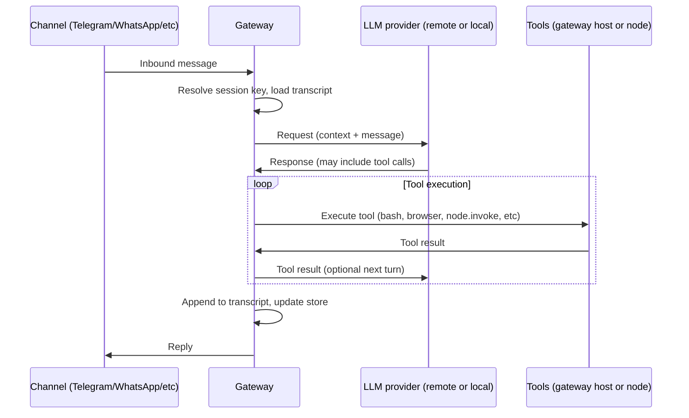
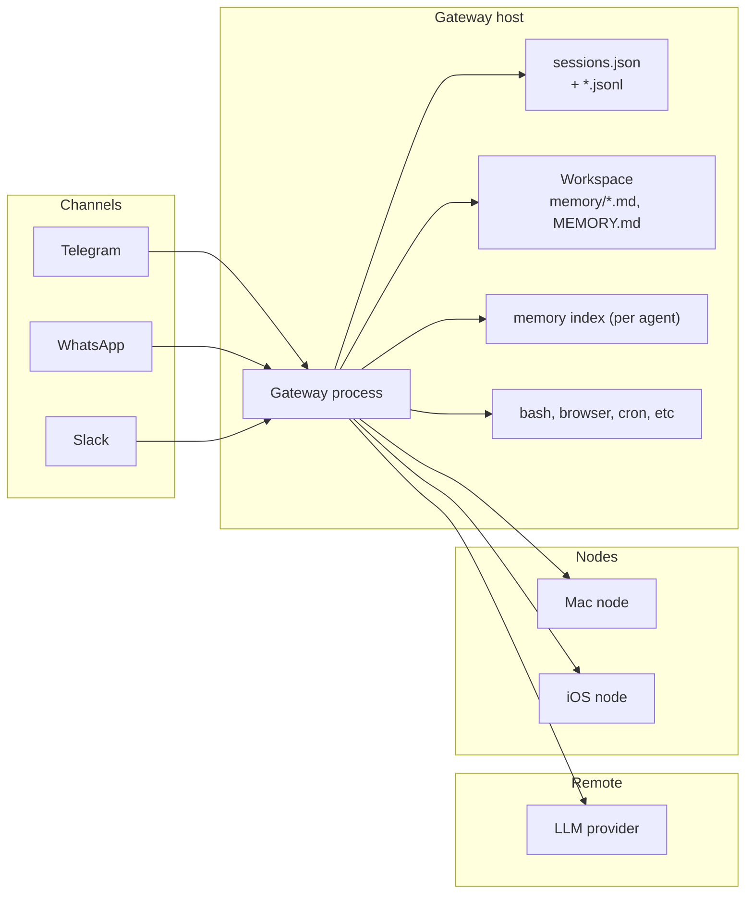

# Gateway execution and memory

Last updated: 2026-01-30

This doc explains how the Gateway mediates LLM calls and tool execution, where session and memory data are stored locally, and how gateway tools differ from node tools. For protocol and client flows, see [Gateway architecture](/concepts/architecture). For session keys and lifecycle, see [Session management](/concepts/session). For memory file layout and search, see [Memory](/concepts/memory).

## System flow



1. **Inbound message**: A channel (Telegram, WhatsApp, Slack, etc.) delivers a message to the Gateway. The Gateway owns the connection to each provider.
2. **Session resolution**: The Gateway maps the message to a session key (e.g. `agent:main:main` for DMs, or `agent:main:telegram:group:<id>` for a group). It loads or creates a session entry in the store and opens the transcript file for that session.
3. **LLM call**: The Gateway builds the request (system prompt, injected files, transcript history, current message) and sends it to the configured LLM provider (OpenAI, Anthropic, or a local endpoint). The **LLM runs where the provider lives** (usually remote; see [Local vs remote](#local-vs-remote)).
4. **Tool execution**: If the model returns tool calls, the **Gateway executes them**. Gateway-host tools (bash, browser, cron, read/write, etc.) run on the Gateway host. Node tools (camera, canvas, screen.record, location.get, etc.) are sent to the paired device via `node.invoke` and run on that device.
5. **Persistence**: After each turn, the Gateway appends the conversation to the session transcript (JSONL) and updates the session store (token counts, updatedAt). Long-term memory is written by the model into workspace Markdown files when you use memory tools or when the pre-compaction memory flush runs.
6. **Reply**: The Gateway sends the final reply back to the same channel (e.g. Telegram); the model does not choose the channel.

## Where data lives

All of the following live on the **Gateway host** (or the machine where the Gateway process runs). In a remote setup, your Mac or phone is a client; the session and memory data you care about for that Gateway are on the remote host.

| Data | Location | Notes |
|------|----------|--------|
| Session store | `~/.clawdbot/agents/<agentId>/sessions/sessions.json` | Map of sessionKey to SessionEntry (sessionId, updatedAt, token counts, toggles). Configurable via `session.store` and state dir. |
| Transcripts | `~/.clawdbot/agents/<agentId>/sessions/<sessionId>.jsonl` | Append-only JSONL per session. Telegram topics: `<sessionId>-topic-<threadId>.jsonl`. |
| Memory files | `<workspace>/memory/YYYY-MM-DD-slug.md`, `<workspace>/MEMORY.md` | Default workspace is `~/clawd` (`agents.defaults.workspace`). Plain Markdown; the model writes here via tools or memory flush. |
| Memory index | `~/.clawdbot/memory/<agentId>.sqlite` | Optional vector (and optionally hybrid) search over memory Markdown; used by `memory_search` tool. |

### Memory file details

**How memory is used in agent loop:**

| File | Loaded When | How |
|------|-------------|-----|
| `MEMORY.md` | Always | Direct in system prompt (bootstrap context) |
| `memory/*.md` | On-demand | Via `memory_search` + `memory_get` tools |

- `MEMORY.md` is "always-on short-term memory" — content is injected into every agent run
- `memory/*.md` is "searchable long-term memory" — the agent uses semantic search (vector + BM25 hybrid) to find relevant past notes

**How memory files are created:**

| Trigger | What Happens |
|---------|--------------|
| `/new` command | Session-memory hook saves previous session → `memory/YYYY-MM-DD-slug.md` |
| Agent writes | Agent uses write/edit tools → `MEMORY.md` or new files |
| Manual | User creates/edits files directly |

The `/new` command triggers the `session-memory` hook, which uses LLM to generate a descriptive slug (e.g., "api-design", "bug-fix") from the conversation.

- **Gateway is the source of truth**: UI clients (macOS app, WebChat) do not read these files directly; they query the Gateway over WebSocket for session lists, history, and status. See [Session management](/concepts/session#gateway-is-the-source-of-truth).
- **State directory**: Base path is `~/.clawdbot` unless overridden by `CLAWDBOT_STATE_DIR` or `MOLTBOT_STATE_DIR`.

## Tool execution: gateway vs node

- **Gateway-host tools**: Run on the same machine as the Gateway process. Examples: `bash`, `read`, `write`, `edit`, browser control, cron, webhooks, Discord/Slack actions, `sessions_list` / `sessions_send`, and (when allowed) `gateway`-scoped actions. The Gateway has direct access to the workspace and the host filesystem (subject to sandbox config for non-main sessions).
- **Node tools**: Run on a **paired device** (macOS app, iOS, Android, or headless node). Nodes connect to the same WebSocket server with `role: node` and advertise commands such as `canvas.*`, `camera.*`, `screen.record`, `location.get`, and on macOS `system.run` / `system.notify`. The Gateway does not execute these; it sends `node.invoke` to the node, and the node runs the command and returns the result. See [Gateway architecture](/concepts/architecture) for the node role and [Nodes](/nodes) for capabilities.

So: **conversations and executions** (transcript, session metadata, tool results in context, and memory files) **are local to the Gateway host and the workspace**. Only the LLM inference is typically remote unless you point the Gateway at a local model endpoint.

## Gateway as background daemon

The Gateway runs as a **system-managed background service**, not just a shell process:

| Platform | Service Manager | Config File |
|----------|-----------------|-------------|
| **macOS** | launchd | `~/Library/LaunchAgents/dev.openclaw.gateway.plist` |
| **Linux** | systemd | `~/.config/systemd/user/openclaw-gateway.service` |
| **Windows** | Task Scheduler | Scheduled task `OpenClawGateway` |

The daemon includes auto-restart (`KeepAlive` on macOS, `Restart=always` on Linux) so the Gateway recovers from crashes automatically.

**CLI commands:**

```bash
openclaw daemon status    # Check if running
openclaw daemon restart   # Restart gateway
openclaw daemon stop      # Stop gateway
openclaw daemon start     # Start gateway
openclaw daemon uninstall # Remove from auto-start
openclaw daemon install   # Reinstall daemon
```

### Sleep/wake handling

When a laptop sleeps and wakes, network connections drop but the Gateway process survives. Each channel has **exponential backoff reconnection**:

- First retry: 2 seconds
- Max wait: 30 seconds
- Factor: 1.8x exponential
- Max attempts: 12

This means after wake, channels automatically reconnect within seconds. If the process crashes, the daemon manager restarts it immediately.

## Local vs remote

- **LLM calls**: Usually **remote** (OpenAI, Anthropic, etc.). To run the model locally, you configure a local provider endpoint in [Models](/concepts/models) and set the agent model to that provider/model.
- **Session and transcript storage**: **Local** to the Gateway host (`~/.clawdbot/agents/...`).
- **Memory files**: **Local** to the Gateway host (workspace under `~/clawd` or your `agents.defaults.workspace`).
- **Memory search index**: **Local** (`~/.clawdbot/memory/<agentId>.sqlite`). Embeddings for the index can be remote (OpenAI, Gemini) or local (e.g. node-llama-cpp); see [Memory](/concepts/memory).
- **Tool execution**: **Local** to either the Gateway host (gateway tools) or the node device (node tools).

## Diagram: components and data flow



- **Channels** push messages to the Gateway; the Gateway pushes replies back.
- **Gateway host** holds the Gateway process, session store, transcripts, workspace (memory files), optional memory index, and gateway-scoped tools.
- **LLM provider** is typically remote; the Gateway sends prompts and receives replies and tool calls.
- **Nodes** run device-local tools; the Gateway routes `node.invoke` to the correct node.

## See also

- [Gateway architecture](/concepts/architecture) for the WebSocket control plane and client/node roles.
- [Gateway runbook](/gateway) for how to run and operate the Gateway.
- [Session management](/concepts/session) for session keys, lifecycle, and store layout.
- [Memory](/concepts/memory) for memory file layout, pre-compaction flush, and memory search.

To map this to a specific deployment (e.g. single Mac mini vs remote Gateway plus local nodes), see [Remote gateway](/gateway/remote). To configure local model endpoints or memory search providers, see [Models](/concepts/models) and [Memory](/concepts/memory).
