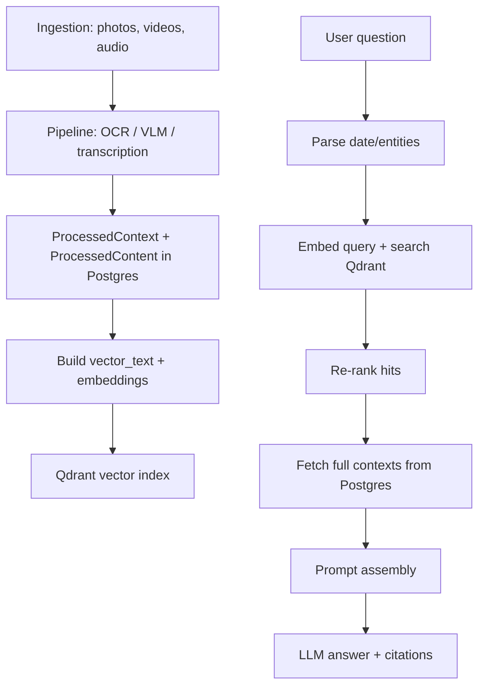

# RAG Details (OmniMemory)

This document explains how the current RAG (retrieval-augmented generation) flow works in OmniMemory and what metadata it can access (labels, context, keywords, entities).

## Overview

RAG is built on top of `ProcessedContext` records created during ingestion. Each context has a label-like type (`context_type`), a title, a summary, keywords, entities, timestamps, and source item references. These are embedded into Qdrant for retrieval and then re-hydrated from Postgres for prompt building.

## Data used for retrieval

Each `ProcessedContext` record includes:
- `context_type`: label-like category (examples: `activity_context`, `daily_summary`, `memory_context`).
- `title`: human-readable label for the context.
- `summary`: primary text used for the final answer.
- `keywords`: normalized tags.
- `entities`: extracted entities (people, objects, places, etc).
- `event_time_utc`, `start_time_utc`, `end_time_utc`.
- `source_item_ids`: links back to `SourceItem` rows (photos, videos, audio).

During indexing, the system stores:
- `vector_text` (built from summary/title/keywords, stored in Postgres).
- Qdrant payload fields: `context_id`, `context_type`, `is_episode`, `event_time_utc`, `source_item_ids`, `entities`.

## Retrieval flow

1) Parse the user query for date ranges and entity hints.
2) Embed the query and search Qdrant for `ProcessedContext` matches.
3) Re-rank hits using:
   - date window filter
   - entity match boosts
   - episode boost
   - time decay
4) Fetch full contexts from Postgres by `context_id`.
5) Build the chat prompt with recent daily summaries, conversation history, and the retrieved context blocks.

## Prompt composition

The chat prompt is assembled as:
- system instruction
- recent daily summaries (last 7 days)
- conversation history
- relevant memory blocks
- user question

Each memory block includes timestamp, title, summary, and location when available.

## Can RAG access labels and context?

Yes.

- Labels are available through `context_type` and `title`.
- Context content includes `summary`, `keywords`, `entities`, and timestamps.
- Qdrant only stores the payload needed for filtering and reranking; the full label and context text are retrieved from Postgres after the vector search.

## Diagram

## Notes and limits

- Only the top-K contexts are retrieved for each request.
- Context payload in Qdrant is minimal; the full text lives in Postgres.
- Surprise detection is not a dedicated pipeline step yet. It can be done on-demand in a downstream agent or added as an optional enrichment step during ingestion.
